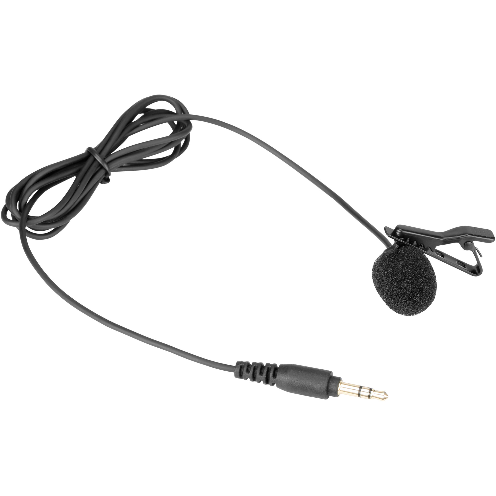
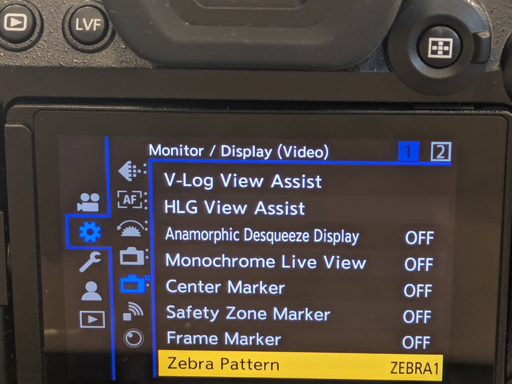

# Custom Mode 1 Settings: A Reference

## Setting the Correct Mode

The camera is capable of several different functions. For the purposes of recording video of actor monologues, we want to _**make sure the mode dial is turned so that the film camera icon followed by the letter M, is clicked in and aligns with the white indicator mark on the left**_. This is Movie Manual mode, which will provide you with the largest array of movie recording options.&#x20;

<mark style="background-color:yellow;">NOTE: We have set the ideal settings already set in custom mode 1, which can also be accessed by turning the mode dial</mark>

&#x20;

<figure><figcaption></figcaption></figure>

## Starting and Stopping a Recording

You can start or stop a recording by pressing the same red dedicated movie recording button on the top panel.&#x20;

<figure><figcaption></figcaption></figure>

 

<figure><figcaption>
What the red recording indicator looks like on the  LCD Screen
</figcaption></figure>

You can confirm that you are recording by seeing a red bounding box and red dot indicator appear in your LCD panel.&#x20;

## Menu Settings (the essentials)

to get into the menu settings, with the camera on, push the Menu/Set Button in the center of the jog wheel

<figure><figcaption></figcaption></figure>

<mark style="background-color:yellow;">For the following settings the "</mark><mark style="background-color:yellow;">**>**</mark><mark style="background-color:yellow;">"</mark> <mark style="background-color:yellow;">icon indicates progressing through the menu path, which you can do using the jog wheel or by using the touch screen with your finger</mark>

### Video Recording Settings (Red Video Camera Icon)

#### <mark style="background-color:red;">Image Quality Submenu</mark>

Image Quality (1) > Exposure Mode> M for manual

Image Quality (1) > Photo Style > CNED2 (Cinema D 2)

Image Quality (1) > Synchro Scan > OFF

<figure><figcaption></figcaption></figure>

 

<figure><figcaption></figcaption></figure>

 

<figure><figcaption></figcaption></figure>

Image Quality (1) > SS/Gain Operation > SEC/ISO

<figure><figcaption></figcaption></figure>

#### <mark style="background-color:red;">Image Format Submenu</mark>

Image Format > Rec.File Format > MP4

Image Format > Image Area of Video > FULL

Image Format > Rec Quality > 4K | 10bit | 72M | 30p

<figure><figcaption></figcaption></figure>

 

<figure><figcaption></figcaption></figure>

 

<figure><figcaption></figcaption></figure>

<mark style="background-color:red;">**Focus Submenu**</mark>\
\
Focus > Detecting Subject > Human

Focus > Focus Peaking > ON

<figure><figcaption></figcaption></figure>

 

<figure><figcaption></figcaption></figure>

#### <mark style="background-color:red;">Audio Submenu</mark>

Audio (1) > Sound Rec Level Disp. > ON

Audio (1) > Sound Rex Level Adj > -18DB

<figure><figcaption></figcaption></figure>

 

<figure><figcaption></figcaption></figure>

#### Audio Options based on Microphone

_**The Zoom M3**_ provides its own power, therefore the correct setting is:&#x20;

&#x20;Audio 1 > Mic Socket > Mic

<figure><figcaption></figcaption></figure>

 

<figure><figcaption></figcaption></figure>

 

<figure><figcaption></figcaption></figure>

_**The Wired Lav Mic**_ requires additional power, therefore the correct setting is:&#x20;

&#x20;Audio 1 > Mic Socket > Mic Plug-in Power

<figure><figcaption></figcaption></figure>

 

<figure><figcaption></figcaption></figure>

 

<figure><figcaption></figcaption></figure>

<mark style="background-color:red;">**Other Video Submenu**</mark>

Others (Video) > Image Stabilizer > Operation Mode > Normal&#x20;

Others (Video) > Image Stabilizer > All other options should be set to  OFF

<figure><figcaption></figcaption></figure>

 

<figure><figcaption></figcaption></figure>

## Blue Gear Icon

<mark style="background-color:blue;">**Focus Shutter Submenu**</mark>

Focus/Shutter > Quick AF > On

<figure><figcaption></figcaption></figure>

<mark style="background-color:blue;">**Monitor Submenu**</mark>

Monitor > Display (Video 1) > Zebra Pattern > ZEBRA 1

Monitor > Display (Video 2) > Zebra Pattern > Red REC Frame Indicator > ON

<figure><figcaption></figcaption></figure>

 

<figure><figcaption></figcaption></figure>

## Blue Wrench Icon

Card > File > Double Card Slot Function > Recording Method > Back Up

_<mark style="background-color:yellow;">This allows for each recording to be dual recorded, one on the student SD card in slot 1 and the another in the instructor SD card in slot 2</mark>_

<figure><figcaption></figcaption></figure>

 

<figure><figcaption></figcaption></figure>

