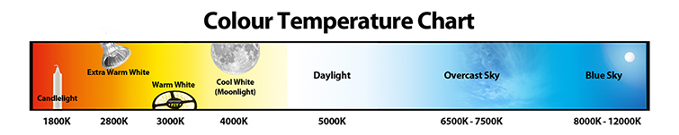
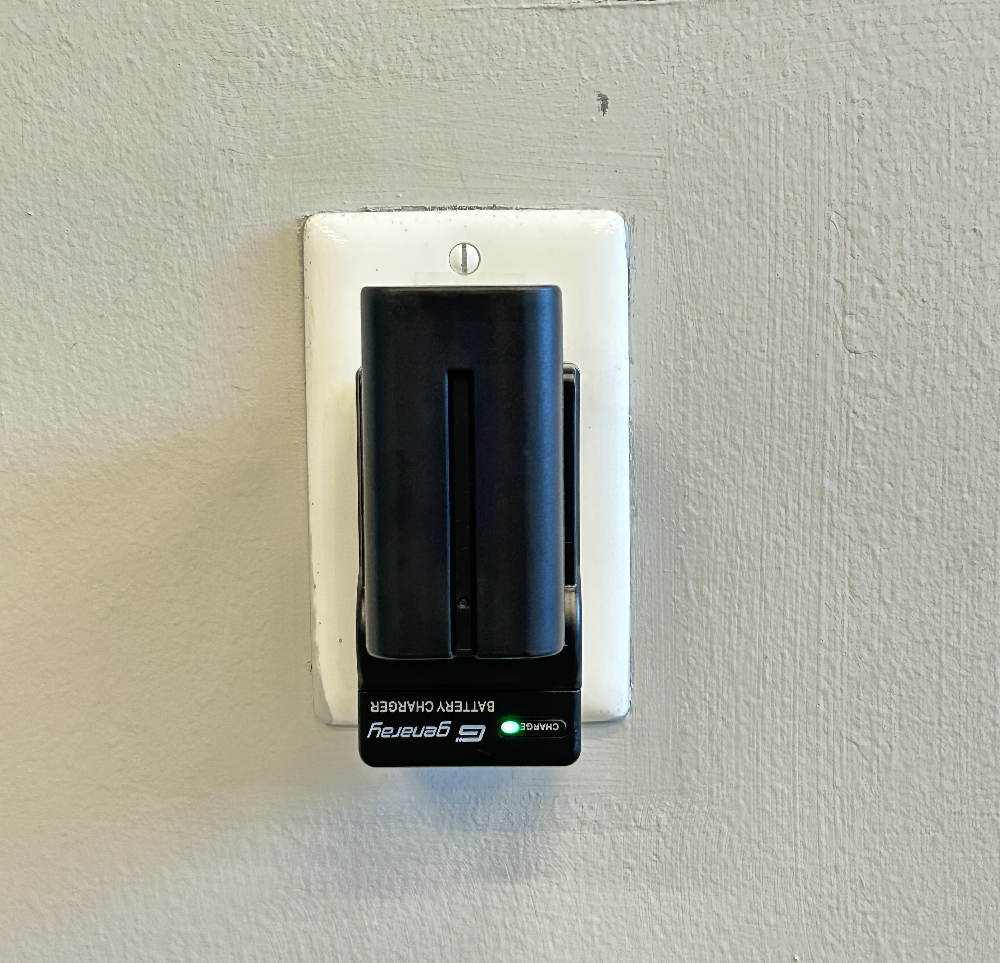

# Neewer Light Kit

### Setting up the Lights

Inside the Neewer light kit, you will find two light panels and light two stands as well as the necessary cables and batteries. These two lights should be sufficient to light most smaller scenes.

To begin using the lights, remove the light stands from the case and set them up approximately where you want your lights to be. If you need to learn how to set up a light stand, check out this video:&#x20;



Now you are ready to attach your lights. Take your lights from the case and place them on top of the stand positioned towards your subject. Use the screw to securely fasten each light to its stands.

<figure><figcaption></figcaption></figure>

 

<figure><figcaption></figcaption></figure>

Next, take the cables from the case and plug them into the outlet nearest your lights. Plug the smaller end of your cable into the plug labeled "DC 12-15V".&#x20;

For your final step, just open up the barn doors on the front of the lighting unit. Your lights should now be ready to turn on!

<figure><figcaption></figcaption></figure>

 

<figure><figcaption>
Use the barndoors to adjust where your light is going
</figcaption></figure>

### Using the Lights

To turn on the lights, just flip the switch on the back of the unit. There are two options, battery-powered or wall-powered. For most use cases, you will set it to wall-powered.&#x20;

<figure><figcaption>
Wall-powered on right and battery-powered on left
</figcaption></figure>

 

<figure><figcaption>
Let there be light!
</figcaption></figure>

The light should now be on! You can now use the dials on the back of the lighting unit to adjust intensity and color temperature. The left dial (labeled HSI) controls color temp. The right dial (labeled BRR) controls brightness. Use the screen on the back of the unit to view your settings.

<figure><figcaption></figcaption></figure>

For a basic understanding of how to set your color temperature, check out this chart:

<figure><figcaption>
5600K is best for recreating daylight, while 3200K is best for recreating warm, indoor lights.
</figcaption></figure>

Feel free to move around the lighting units here, so they best suit your scene. For some basic tips on how best to position lights, check out our guide to two-point lighting at the bottom of this page! As a rule of thumb, the closer you position the light to your subject, the softer the light will be.

<mark style="background-color:blue;">Optional: Battery Powered</mark>

The Neewer Light Kit comes with additional batteries as well as battery chargers that allow you to use the unit if you are outdoors or otherwise away from a power source. When using the batteries, just be aware that they have a finite running time and consider turning off the units when not actively using them. We would also recommend charging your batteries overnight if possible. Remember to switch the unit to battery-powered when using batteries!

<figure><figcaption>
Charging batteries
</figcaption></figure>

 

<figure><figcaption>
Batteries on lights, there will be an indicator on the back screen that shows your battery percentage
</figcaption></figure>

### Packing up the Lights

To pack up the lighting units, just follow the steps you used to set up the lights in reverse. All of the items, including stands, batteries, and cables, should fit neatly back inside the case.

<figure><figcaption></figcaption></figure>

 

<figure><figcaption></figcaption></figure>

## <mark style="background-color:orange;">Two-Point Lighting:</mark>

Check out this tutorial on two-point lighting using these exact panels:



As explained in the video, two common ways to utilize two-point lighting are with a key and fill setup and a key and back setup. In the key and fill setup, both lights are in front of the subject with one brighter unit acting as a "key" light and one dimmer unit acting as a "fill" light to help fill in the shadows. In the key and back setup, you keep the "key" light in front of the subject and place the second light behind the subject as a "back" light to separate them from the background.

<figure><figcaption></figcaption></figure>

 

<figure><figcaption></figcaption></figure>

While either setup can be used for any scene, here are some tips on how to choose which to use. Given its softer, more natural look, key and fill lighting may be better suited when you are trying to flatter your subject for more of a beauty look. Given its higher contrast look, key and back lighting may be better suited to a more dramatic, "cinematic" look.
