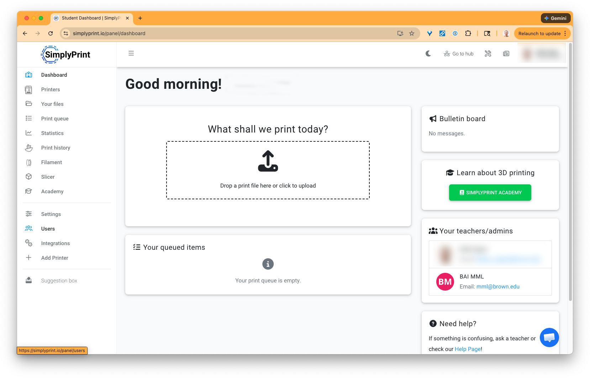
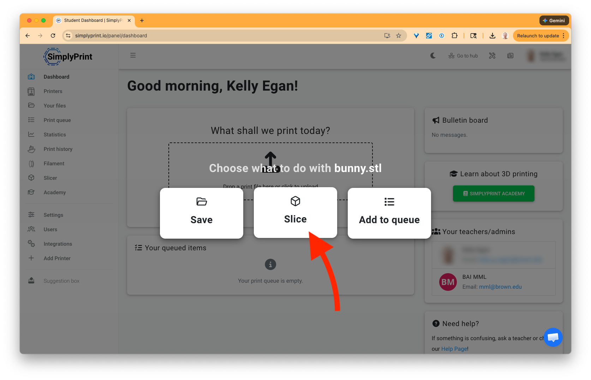
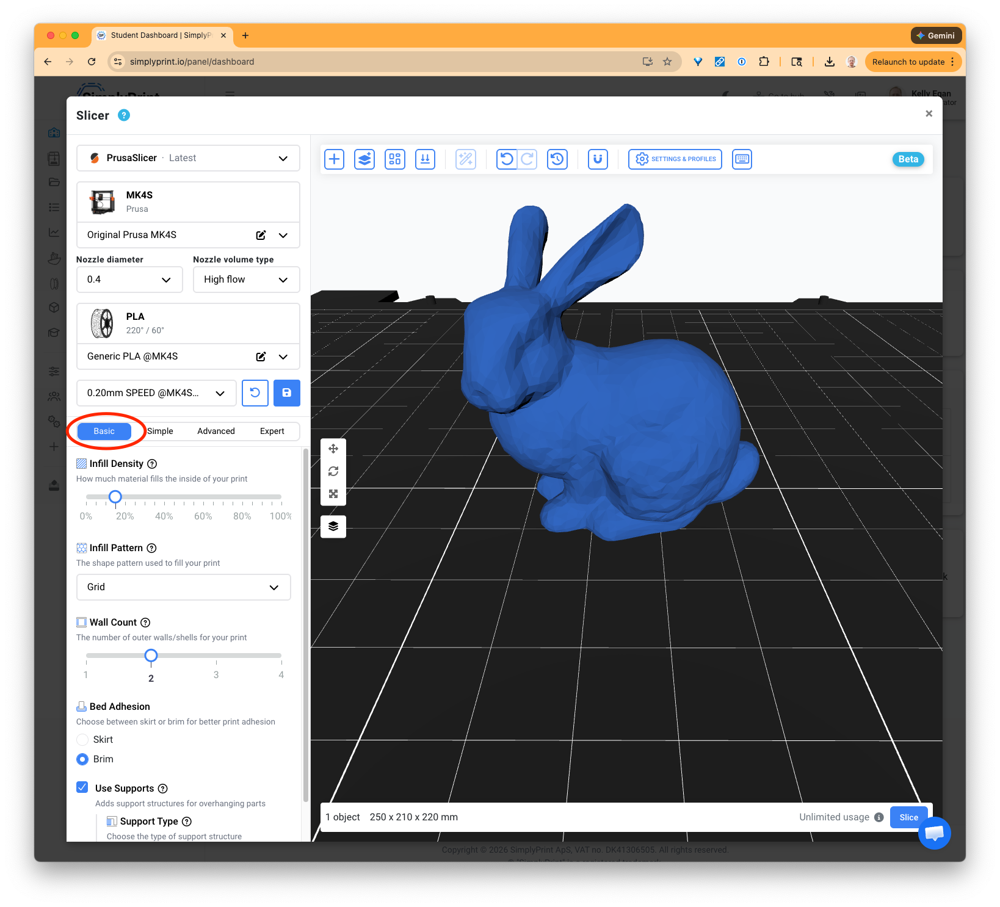
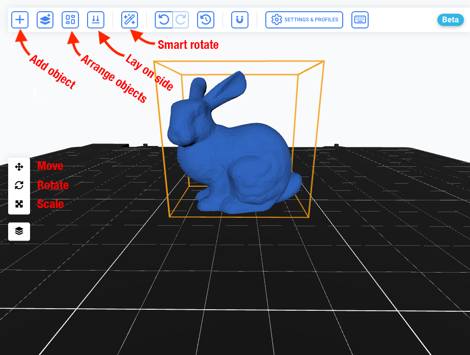

# 🖨️ 3D Printing using SimplyPrint

**BEFORE using the 3D printers you must**:

* [ ] Complete the online quiz
* [ ] Meet with a Creative Technology Assistant

For more information go to [https://go.brown.edu/cats-3dprinting](https://go.brown.edu/cats-3dprinting)

***

CATS uses the online platform SimplyPrint to handle all 3D printing. Attempting to print using the printers directly or via USB is not permitted.

### Only print from the Physical Media Lab

While SimplyPrint is an online platform for handling 3D printing we require all users to start prints while they are physically present in the Physical Media Lab in order to ensure that the print starts successfully. <mark style="color:$warning;">Failure to be present when printing can result in loss of printing privileges.</mark>

### 1. Log in to SimplyPrint

During your training with the Creative Technology Assistant they will create a SimplyPrint account. You can log in to your account at [https://simplyprint.io/panel/login](https://simplyprint.io/panel/login)

After you log in you should see your dashboard which looks something like this:

<figure><figcaption></figcaption></figure>

### 2. Uploading your 3D model

SimplyPrint accepts a variety of 3D model formats including:

* STLs
* OBJs
* STEP

In addition advance users can upload gcode files directly to SimplyPrint. **Any gcode upload must be  designed specifically for the Prusa MK4S printers we have in the lab.**&#x20;

If you have questions about using gcode please consult with the CTA or email cats@brown.edu

#### Choose slicing

When you upload your 3D model it will ask you if you want to save the model file, slice it or add to queue. Saving will save the unsliced model file for later use. We want to slice the file so choose that.

<figure><figcaption></figcaption></figure>

We do not use queues so never use the "Add to queue" option.

### 3. Slicing settings

**We recommend that beginners use the "Basic" settings for slicing.**&#x20;

<figure><figcaption></figcaption></figure>

#### **Select preset**&#x20;

Choose **0.20mm SPEED @MK4S HF 0.4**. This is a good default setting for most prints.

#### **Infill Density**

Choose **20% infill.** &#x20;

Prints rarely need more than 20-30% infill. For increase print strength the Wall Count is a more important setting. Higher infill increases print time and wastes filament.

#### Wall Count 

Choose _**2 perimeter walls**_.

This setting has the most effect on print strength. If you need a stronger prints you can increase the perimeter walls to 3 or 4.

#### Bed adhesions 

**Add a Brim if needed**. Adding a b**rim** can help secure prints to the bed preventing them from falling off the bed. This is important for prints with small bed footprint or long prints that might begin to warp as the print continues.

#### Use supports 

**Turn on supports if needed**. Adding supports is important for any prints that have parts that overhanging parts.

### 4. Adjusting the model

In addition to the slicing you can make adjustments to the model or add additional objects to the bed before slicing.

<figure><figcaption></figcaption></figure>

#### Move, rotate and scale

The three buttons to the left of the 3D view allow you to move, rotate or scale your object. You can either adjust them with the dialog next to the button or use the transform Gizmo/Tool on the object itself.

#### Add objects

You can add more than one object/model to the bed and slice them together.

#### Arrange objects

This option allows you to space multiple objects on the bed.

#### Smart rotate

SimplyPrint can analyze your model and identify what it thinks is the best face to rest on the bed.&#x20;

#### Lay on side

This option lets you choose a specific face and SimplyPrint will place that face on the bed.

### 5. Slice preview

Once you have adjusted the model and settings you can hit slice. SimplyPrint will then present you with a preview of your sliced model.&#x20;

#### Warnings

If SimplyPrint give you a warning, such as "poor bed adhesion", read through its advice and hit the **Prepare button** in the upper right corner of the 3D view to return to the slicing settings and adjustments.

#### Print Info

The box at the lower left of the 3D preview labeled **Print Info** will show you information about print time. You can ignore information about cost as we currently do not charge for prints.

### 6. Printing

When you are ready hit **Print** button. You will be shown the available printers.&#x20;

The box in the upper right of the Printers card shows its status:

* Green means the printer should be ready to print
* Blue means there is currently a job printing
* Red means there is a problem with the printer.

<mark style="color:$warning;">**IMPORTANT**</mark> <mark style="color:$warning;"></mark><mark style="color:$warning;">Before selecting and printing. Inspect the physical printer. Make sure that nothing is on the bed. The build plate is on the bed and there are no other problems with the printer.</mark>&#x20;

Select a printer that is available and once you verify it is ready hit print.

<mark style="color:$warning;">**IMPORTANT**</mark> <mark style="color:$warning;"></mark><mark style="color:$warning;">You must be present for the first three layers or first 10 minutes of the print before leaving.</mark>

Please see [our website](https://go.brown.edu/cats-3dprinting) for information on maximum print time, number of printers, removing prints and other policies.

Happy printing!

<figure><figcaption></figcaption></figure>

