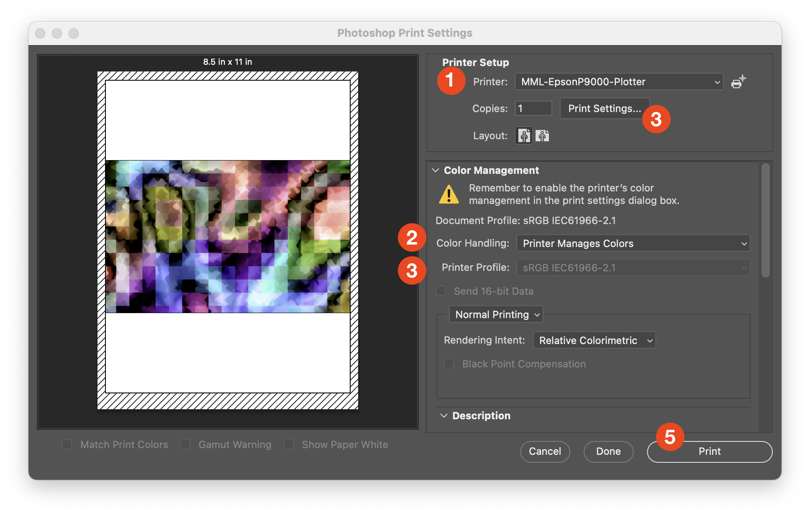
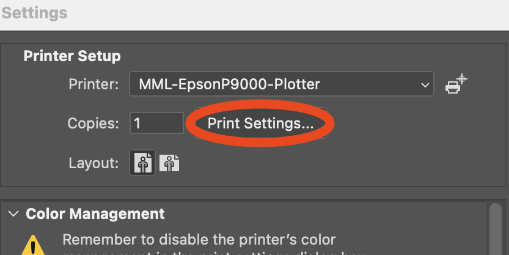
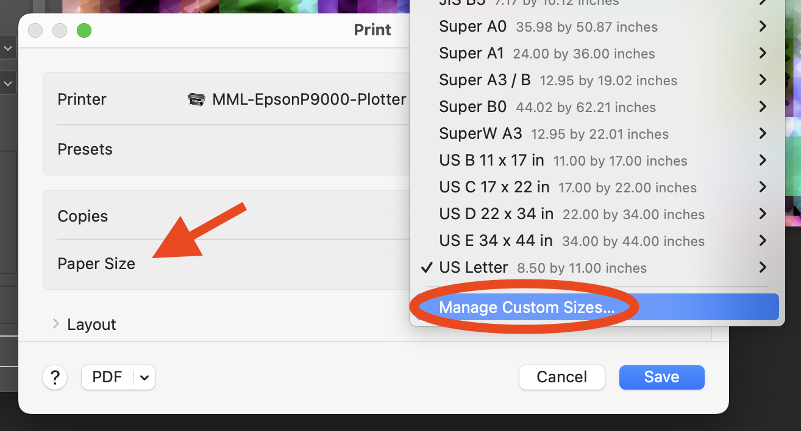
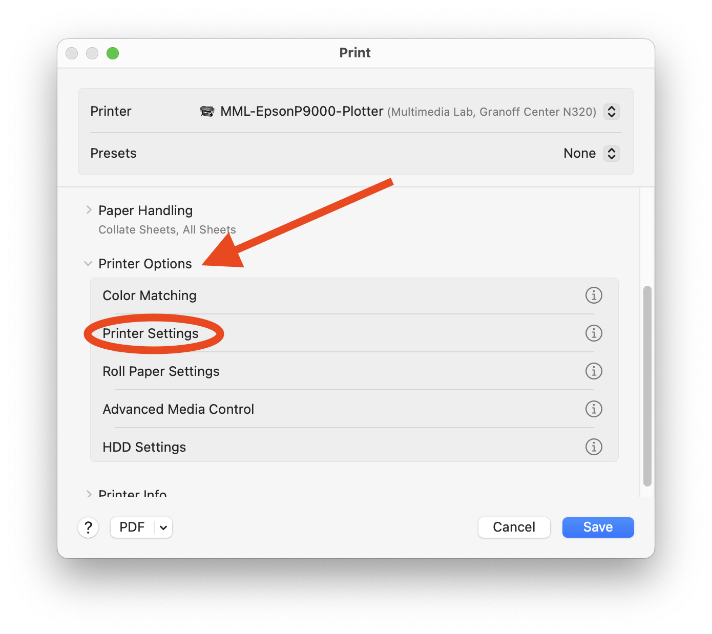

# 🖨 Printing to the Epson Stylus P9000

**BEFORE using the printer you must**:

* [ ] Complete the online quiz
* [ ] Meet with a Creative Technology Assistant

For more information go to [https://go.brown.edu/mml-printing](https://go.brown.edu/mml-printing)

## Print from a lab computer

Once you have been approved and processed you must log into a lab workstation using your Brown username and password. The printer will not work with personal computers.

_\*You can check your balance by logging in here:_ [_https://myprint.brown.edu/user_](https://myprint.brown.edu/user)

_\*We recommend printing from Photoshop even when printing vector-based images._

## Loading paper

We have two types of paper:

* **Enhanced Matte Paper**
* **PremiumLuster Photo Paper**

You may need to change the roll to your preferred type before printing. This is covered in the in-person check-in with a Creative Technology Assistant. If you need to refresh your memory you can watch the [video tutorial](https://www.youtube.com/watch?v=u64cn07PCOk).

## Sizing your document

Before printing check your image size and resolution in Photoshop by going to the menu _**Image → Image Size.**_

**Resolution:** 200 to 300 pixels per inch

**Dimensions:** Up to 44 inches wide by length of roll

The longer your image and the greater the resolution the longer your print will take to process. Images over 1GB are likely to fail. You may need to balance image dimensions and resolution to keep the file size small enough.

REMINDER: (or write down) your image dimensions to help you size your custom paper size later on.

## Photoshop print dialog

<figure><figcaption></figcaption></figure>

### **1. Choose the printer**

Choose _**MML-EpsonP9000-Plotter**_ as your printer.

If there happen to be other variations of this name, they will likely not function correctly.

_(the screenshots below may show a different name, please ignore)_

### 2. Color handling 

Choose _**Photoshop Manages Colors**_.

In general, Photoshop offers more control than the printer’s color management settings. One exception is when printing Black and White photographs which can use the printer’s “Advance Black and White” setting.

### 3. Printer Profile 

You must set the printer profile to match the paper type. For the profiles for the provided paper are:

* **SC\_P9000\_P7000\_Series\_LLK\_EnhancedMattePaper\_MK**
* **SC\_P9000\_P7000\_Series\_LLK\_PremiumLusterPhotoPaper260**

<figure><figcaption></figcaption></figure>

If you are using your own paper, profiles can often be found online. Email [mml@brown.edu](mailto:mml@brown.edu) if you need help finding a paper profile. **All paper must be approved by the staff before using.**

_\*You can turn on **Corner and Center Crop Marks** under the **Printing Marks section** of the print window. It is often helpful if there is a white border on your print._

### 4. Print settings 

<figure><figcaption></figcaption></figure>

**Note! You’ll need to click “Show Details” to change the settings in this dialog.**

<figure><figcaption></figcaption></figure>

**Paper Size**

Click on _**Manage Custom Sizes**_ and add (+) a new preset.

* **Width:** 44 inches (the width of the paper)
* **Height: AT LEAST** an inch larger than your height dimension **or your image may not print.**
* **Margins:** Set all to zero.

_\*Remember you can rotate tall images that are less than 44 inches wide to save space._

**Printer Settings**

Scroll down and click on **Printer Options.** Then choose _**Printer Settings**_.

<figure><figcaption></figcaption></figure>

Set the options to the following:

* **Page setup:** Roll Paper

<mark style="color:red;background-color:yellow;">**DO NOT choose Roll Paper - Borderless (Auto Expand)**</mark>

* **Media Type**:
  * **Matte Paper > Enhanced Matte**
  * **Photo Paper > Premium Luster Photo Paper (260)**

### _5. Print!_

Once your setting are correct you can hit print. If you are not ready to print but want to save your settings click Done instead of cancel.

<figure><figcaption></figcaption></figure>
