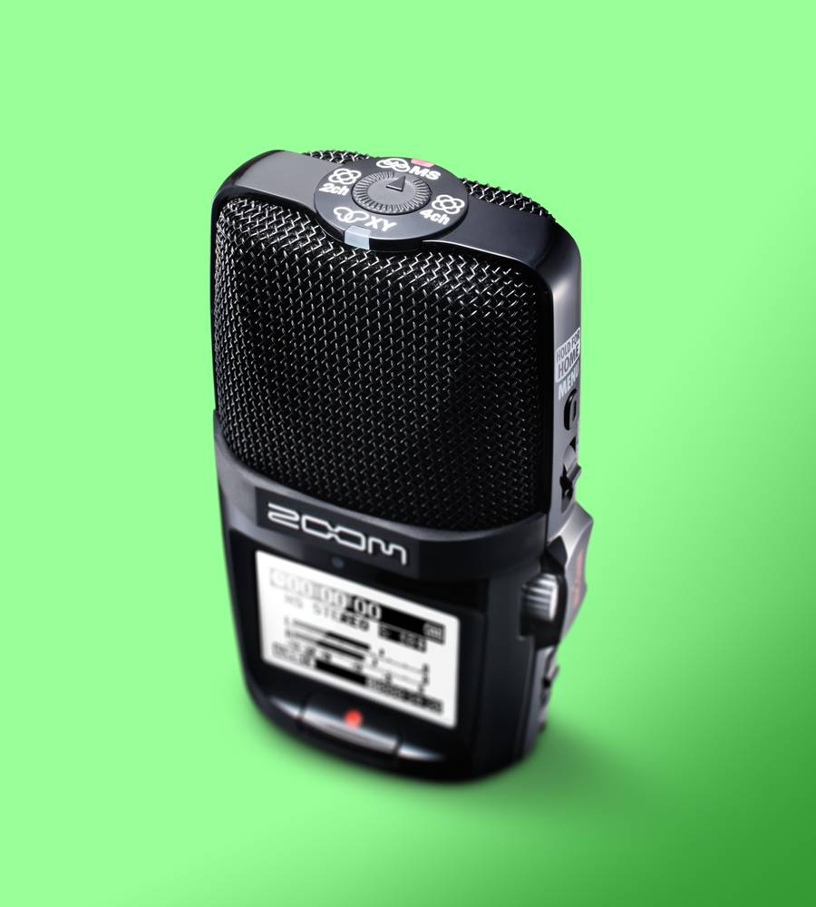
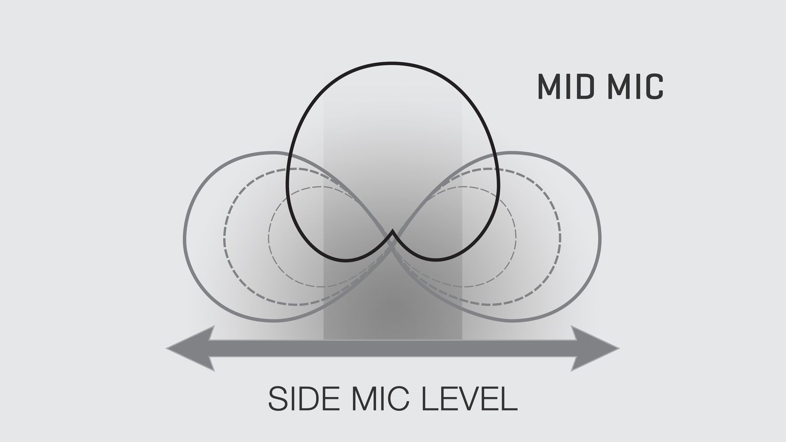
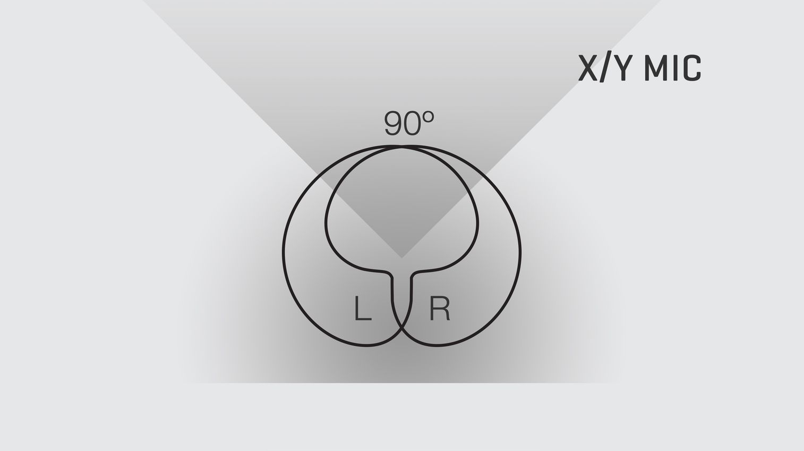
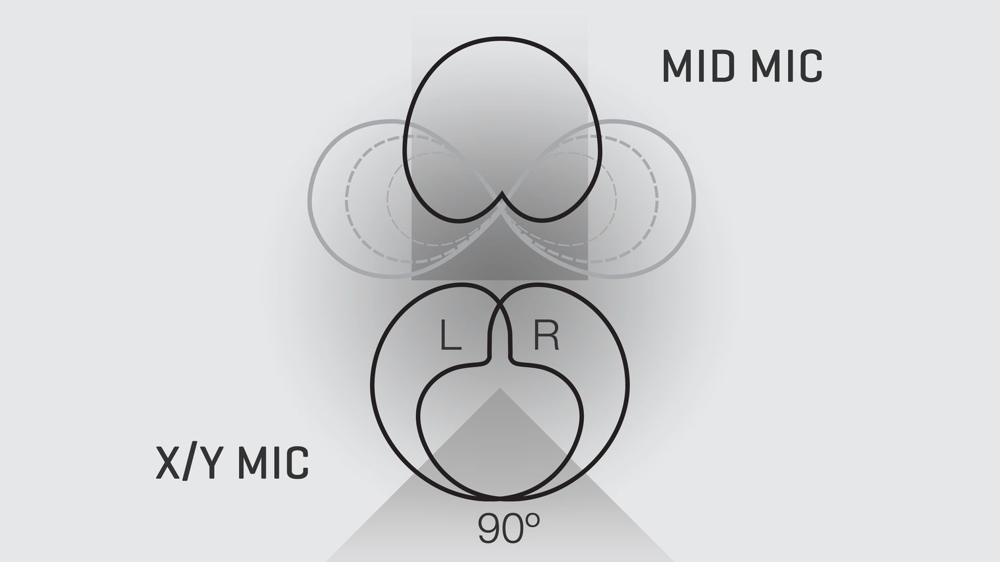

# 4 Channel Surround Sound Field Recorder

[https://zoomcorp.com/media/documents/E\_H2n\_QuickGuide.pdf](https://zoomcorp.com/media/documents/E_H2n_QuickGuide.pdf) - <mark style="background-color:red;">Manual</mark>

This is a versatile audio recorder with 5 built in microphones and most notably 4 different recording modes, **allowing you to record spatial or surround sound audio.**&#x20;

You may also use this as a high-quality usb microphone for recording onto your computer or for a live-streaming call.&#x20;

<figure><figcaption>
Calling Foley Artists
</figcaption></figure>

You may _also_ plug an additional lavalier microphone into the Zoom H2n using phantom power.&#x20;

**The main draw : Choosing your polar pattern**

The H2n has an adjustable nob on the top which allows you to specify how the mics pick up sound, also known as the "polar pattern."&#x20;

The first is **Mid-Side or "MS"**

Mid-Side recording is an incredible technique that allows you to actually adjust the width of the stereo image _after_ it has been recorded, while maintaining perfect mono compatibility, making it especially useful for film, video and television projects.

The three microphone elements in the H2n MS mic are set directly on top of one another. One faces forward and the other two face to the side.

<figure><figcaption>
MS
</figcaption></figure>

The second is **X/Y or "XY"** on the top of the mic for "Natural Sounding Stereo"&#x20;

The X/Y technique provides a great way to cover a wide area while still capturing sound sources in the center with clarity and definition, making it perfect for all types of live stereo recording.

<figure><figcaption>
XY
</figcaption></figure>

Last but certainly not least are the two settings on the side labeled **2channel and 4channel** which combine the mic settings above.&#x20;

The H2n allows you to combine the signals from both the X/Y and MS microphones in order to create surround sound recordings of everything you hear—not just those sounds coming from in front of you, but from all directions.

Use 2ch mode to create a single stereo file of the combined mics, **or 4ch mode to record the signal from the H2n's X/Y mics onto one stereo track and signal from the MS mics onto another**. The resulting pair of tracks can then be routed to separate speakers for an immersive listening experience or can be blended into a custom stereo track. In addition, the H2n's MS decoding feature can be used to independently alter the level of the Side signal in both 2ch and 4ch modes.

<figure><figcaption>
Surround Sound
</figcaption></figure>

<mark style="background-color:red;">Advanced Applications for the H2N</mark>

### Spatial Audio for VR

The Zoom H2n is the only handheld recorder that captures four-channel surround sound audio. With [Firmware v 2.0](https://www.zoom-na.com/products/field-video-recording/field-recording/zoom-h2n-handy-recorder#downloads), it’s perfect for the creation of 360-degree “Spatial Audio” files, the next-generation surround sound format native to the [google JUMP Virtual Reality Platform](https://vr.google.com/jump/).&#x20;

Using “Spatial Audio” or **4channel** mode, you can create a single four-channel, multi-track WAV file that includes Omni, Left/Right, and Forward/Backward tracks. This Spatial Audio file is then ready to be combined with 360-degree VR videos recorded with the google JUMP compatible camera rig (such as the GoPro Odyssey or Ricoh Theta). Once completed, the immersive videos are ready to upload to YouTube.  




