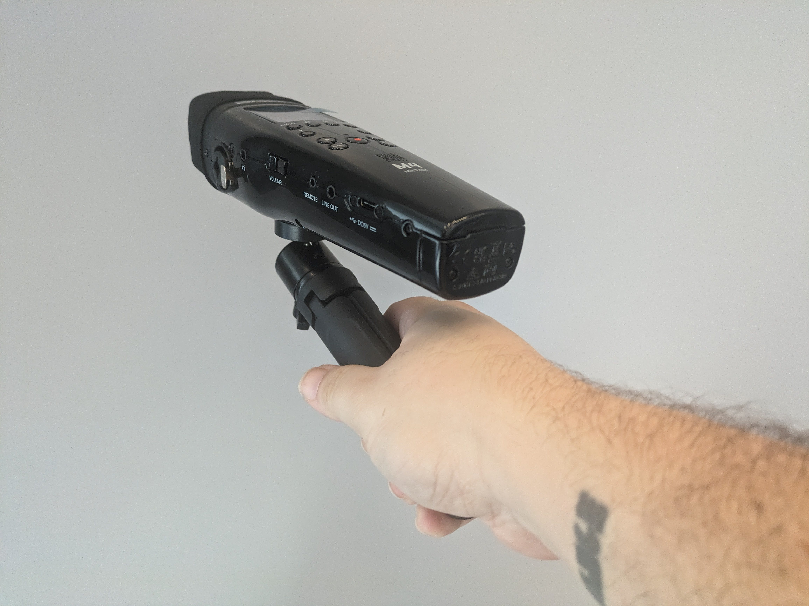

# Set up and Recording Operation

#### [**Zoom M4 Manual**](https://zoomcorp.com/media/documents/E\_M4\_3.pdf)

## Setting up Tabletop Tripod

1. Remove the tabletop tripod and ball head from the kit (located under the M4 recorder)
2. Screw the ball head onto the top of the tripod,&#x20;
3. Screw the tripod with ball head into the underside of the M4 recorder
4. Splay out the tripod feet and place it facing the onboard mics toward the subject of the recording
5. The side screw on the ball head can be loosened and tightened to for more specific positioning of  the M4 recorder.

<figure><figcaption></figcaption></figure>

 

<figure><figcaption></figcaption></figure>

 

<figure><figcaption></figcaption></figure>

The Tabletop Tripod can also be used as a versatile pistol grip for field recordings

<figure><figcaption></figcaption></figure>

## Zoom M4 Diagram + LayOut

<figure><figcaption></figcaption></figure>

 

<figure><figcaption></figcaption></figure>

## Adding and Removing The Batteries

The Zoom M4 utilizes 4 AA batteries to operate. <mark style="color:orange;">Note: It can also operate using the USB-C cord while connected to a computer without batteries</mark>. The kit included 4 Rechargable AA batteries as well a _**wall charger, which is the only way to recharge the batteries**_.&#x20;

To add to remove the batteries:

1. unlock the battery door at the bottom the recorder by rotating the lock screw counter clockwise. If it is difficult to do this with your fingers, you can use a coin or flat head screw driver. <mark style="color:orange;">Note: The screw will never actually fall out. Simply unscrew until the battery door becomes loose</mark>
2. Pull the battery door out, revealing the carriage where the batteries can removed or added.&#x20;
3. Add fully charged batteries to the carriage, then insert the carriage into the M4 and turn the lock screw clockwise until the carriage is again secure.

<figure><figcaption></figcaption></figure>

 

<figure><figcaption></figcaption></figure>

 

<figure><figcaption></figcaption></figure>

## Basic Operations

### Turning the Zoom M4 On/Off

1. Locate the power slider on the side of the audio recorder.&#x20;
   * It is not a traditional button.&#x20;
2. &#x20;pull the power slider down and hold to either turn the zoom on or off

<figure><figcaption></figcaption></figure>

 

<figure><figcaption></figcaption></figure>

### Starting and Stopping a Recording

<mark style="color:orange;">note: you may want to plug-in the provided headphones to monitor sound while you are recording</mark>

1. To start a recording, aim the microphone toward your subject and **press the red record button**
   * You will notice both a waveform on the LCD screen representing the sound as well as the timestamp on the top left of the LCD turn red and begin to count time.&#x20;
   * The M4 is a 32 bit float recorder, meaning there is no need to set microphone gain! You can simply set levels in post production editing.&#x20;
   * <mark style="color:orange;">note:  if you do want to increase or decrease gain, use the "+" and "-" magnifying glass icon buttons below the LCD screen to increase or decrease the gain</mark>
2. To stop a recording, **press the stop button**, not the record button
   * Pressing the record button will add a marker to audio, but it will continue to record
   * if you need to pause your recording, press the play/pause button&#x20;

<figure><figcaption></figcaption></figure>

 

<figure><figcaption></figcaption></figure>

### Playback

To listen back to your recordings:

1. Plug the provided headphones into the heaphone port
2. Press the play/pause button&#x20;
   1. You will see the file load and begin to play.&#x20;
3. Adjust your headphone volume according
4. Use the rewind or fast forward buttons to cycle through multiple recordings if needed
5. Press the stop button to exit playback mode
6.

    

    <figure><figcaption></figcaption></figure>

     

    <figure><figcaption></figcaption></figure>

    

### Setting your Lowcut Filter

Lowcut filters help eliminate frequencies that are often associated with background noise like the low hums of HVAC systems, wind, and other ambient sounds. Having the filter on wont eliminate, but will greatly reduce the need to remove background noise in post-production.&#x20;

_**There are 4 settings for the lowcut filter, including OFF. To change those settings:**_

1. Press the "lo cut" button under the right side of the LCD screen.
2. Press the lo cut button again to choose between 80hz, 160hz, 240hz, and off
   * We recommend 80hz, as that is lower than most human voices, so it shouldn't affect quality when recording dialouge or voice over. The move aggressive (high number) the filter, the more likely you could be cutting out something you want, or possibly distoring the sound in general.&#x20;
3. The menu will disappear on its own once you stop pressing the lo cut button

<figure><figcaption></figcaption></figure>

### Setting The Input:  Stereo vs Mono

You have the option of stereo or mono recording. We recommend using Stereo but if you are unfamiliar with these two concepts, here is a quick video that explains the difference between mono and stereo recording and playback:



To set your input to Mono or Stereo using the on-board mics:

1. Press the input button under the left side of the LCD screen.
2. Press the input button again to choose between mono, stereo, and off
   * _"off" should be selected only when you want to turn off the onboard mics and only use external mics._
3. The menu will disappear on its own once you stop pressing the lo cut button.
4. <mark style="color:orange;">Note that if you are using</mark> <mark style="color:orange;"></mark>_<mark style="color:orange;">**external mics**</mark>_ <mark style="color:orange;"></mark><mark style="color:orange;">that are connected via XLR or 1/4" jack, you can select them as inputs by pressing the "1" and "2" buttons respectively.</mark>

## Working with External Mics/Inputs



## Menu Settings (CHECK EVERY TIME)

To access the menu settings press the menu button on the right side of the recorder. Once the menu pops up on the LCD Screen, you will use the Input, two magnifying glasses, and lo cut buttons to navigate:

<figure><figcaption></figcaption></figure>

 

<figure><figcaption></figcaption></figure>

* <mark style="background-color:green;">Magnifying Glass Minus</mark> button moves up through the menu options
* <mark style="background-color:yellow;">Magnifying Glass Plus</mark> button moves down through the menu options
* <mark style="background-color:purple;">Lo Cut</mark> button enters into submenus or selects a setting
* <mark style="background-color:orange;">Input</mark> button backs you out of a sub menu or main menu

Below we will be giving our recommended settings. _**We suggest you check that these settings are active each time you get an audio kit from checkout**_

### Rec Settings

#### Menu > Rec Settings > Sample Rate

* Select 44.1kHz for recording the human voice in podcast, dialogue, or voice over types of situations
* Select 48kHz for recording music or recording for video production

#### Menu > Rec Settings > Pre Rec

* Select On (6secs). This will include in your recording the 6 seconds before you press the record button. Its a good option for interviews and field recordings

#### Menu > Rec Settings > Rec Start Tone

* Select Off. This tone will just get in the way of catching any spur of the moment sound in your recordings. Instead visually confirm on the LCD screen that you are recording

### SD Card

#### Menu > SD Card > SD Format

* Use this ONLY when you want to erase all content from the SD Card (storage). This may be a good idea to do when you first check out an audio kit, and before you check it back in
  * Remember to back up all your files on your computer before doing so
* Select Execute to clear the SD Card

### System

#### Menu > System > Power > Battery Type

* Select Ni-MH, if using the rechargeable batteries we provide in the kit.
  * If you are using your own batteries, select the appropriate type

#### Menu > System > Power > Plugin Power

* Select Off. By default this should be set to off when just using the onboard mics.&#x20;
  * If you are using an _**external mic**_, it may need plugin power. You should check the instructions of the mic to verify if it does. <mark style="color:orange;">Note: Adding plugin power to a mic that does not need it may either damage the mic or effect the quality of your recording</mark>

### Additional Optional Settings

#### Timecode

Timecode allows you to better sync up audio with other recorded media, such as video and music production. While there isn't a great resource on doing this with zoom m4 yet, pages 93-101 of the manual provide step by step instructions on how to do this:&#x20;



We will be showing you how to transfer your recordings to a computer using the included USB-C cord. This is the preferred way of transferring files. _**Please do not take out the micro-SD card to transfer files unless it is a last resort.**_&#x20;


[transferring-files-+-audio-interface-setup.md](transferring-files-+-audio-interface-setup.md)


##

