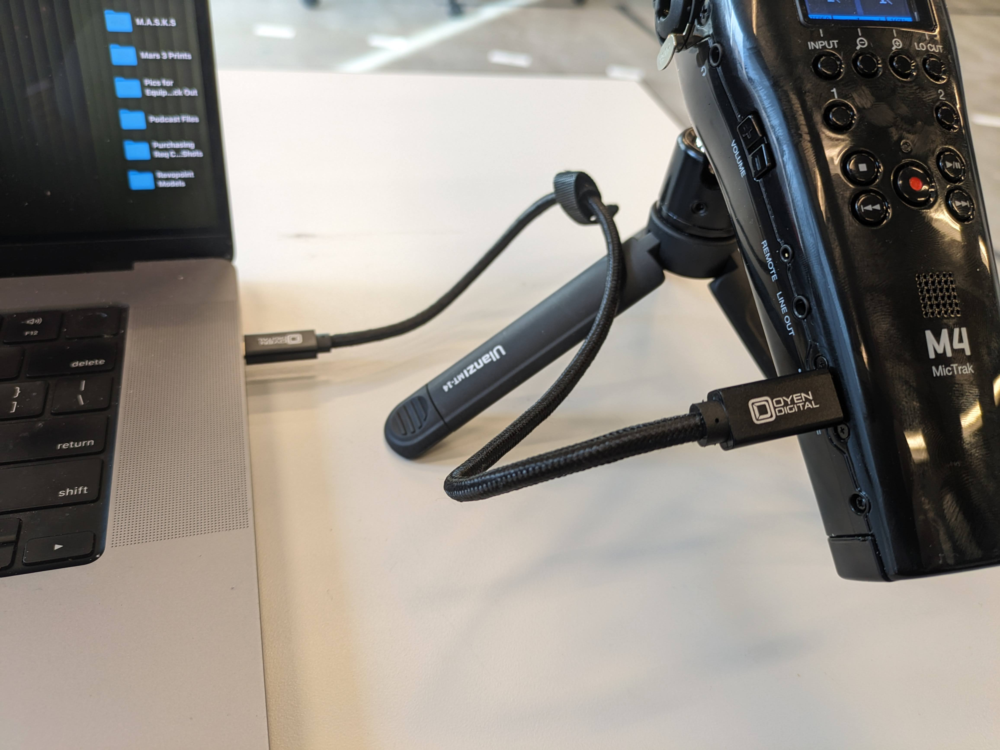

# Transferring Files + Audio Interface Setup

## Initial Setup (for both scenarios)

Connect the provided USB-C cable to both your computer and the Zoom M4

* You may need to use your own adapter to connect the USB-C end depending on your device. If you don't have one, consider working in the [Multimedia Labs](https://sites.google.com/brown.edu/multimedia-labs-new-site/member-orientation) which have USB-C ports.
* <mark style="color:orange;">note:  when connected to file transfer does not require batteries, the Zoom M4 can recieve power through the USB-C cable</mark>

<figure><figcaption></figcaption></figure>

 

<figure><figcaption></figcaption></figure>

## Transferring Recordings / Audio Files onto a Computer

We will be showing you how to transfer your recordings to a computer using the included USB-C cable. This is the preferred way of transferring files. _**Please do not take out the micro-SD card to transfer files unless it is a last resort.**_&#x20;

1\. Turn on the Zoom M4 and access the Menu. Select **USB > File Transfer > PC/Mac**

<figure><figcaption></figcaption></figure>

 

<figure><figcaption>
the physical buttons map to the navigation options in the menu. 
</figcaption></figure>

 

<figure><figcaption></figcaption></figure>

2 . You may have to provide permission on your computer for the Zoom to connect. Once you do, it will show up like any USB drive. Transfer the files as you normally would.&#x20;

<figure><figcaption></figcaption></figure>

3 . When transfer is finished, _**make sure to eject like you would any USB drive from your computer.**_ On the zoom M4, exit the file transfer mode.&#x20;

<figure><figcaption></figcaption></figure>

 

<figure><figcaption></figcaption></figure>

## Audio Interface Setup

_The zoom m4 can be used to record directly to your computer, or connect an external mic or instrument for recording. This connection is known as an  audio interface._

Similar to file transfer above access the menu and then select **USB > USB MIC w/REC > PC/Mac**

You may need to select or route zoom M4 in computer's audio settings. For example on a mac if you wanted to use the M4 as an input for Zoom or Google meeting, you would go into your system settings under sound and select the Zoom M4 for your input

<figure><figcaption></figcaption></figure>

If you are using the zoom M4 as an input with a DAW or other audio software, like Adobe Audition, you may need to set your audio hardware preferences to the Zoom M4. In addition, _**if you are using an external mic, please note that the two external inputs are routed as input 3 or 4 respectively**_, with the onboard mics being the default inputs 1 and 2.&#x20;

<figure><figcaption></figcaption></figure>

 

<figure><figcaption></figcaption></figure>

For additional ideas about using the Zoom M4 as an audio interface please refer to the relevant sections of the manual below:

### Manual (Audio Interface / USB Mic)




