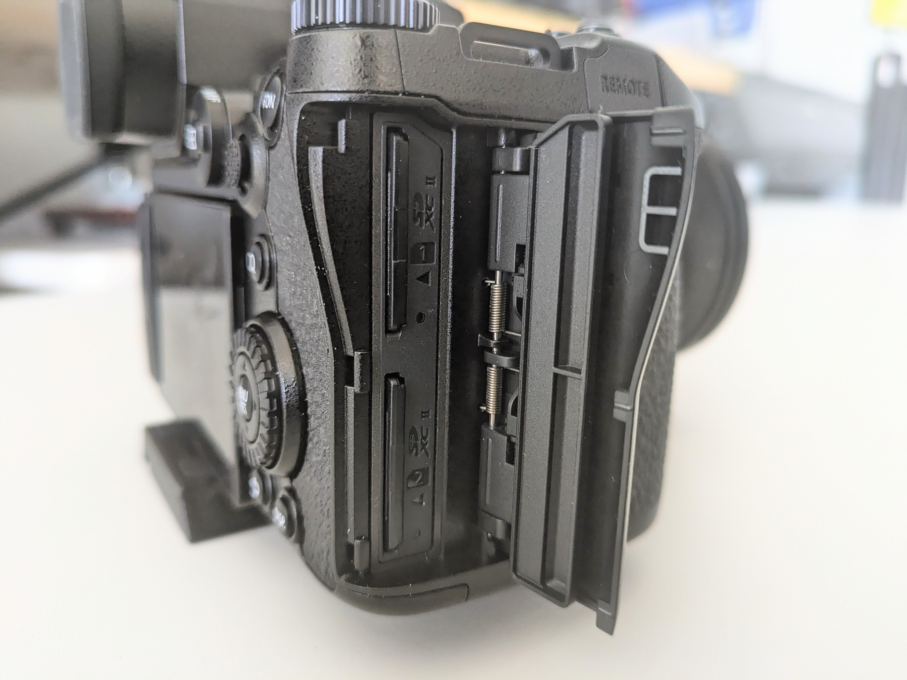

# Basic Operations

## Turning the Camera On/Off

The on/off switch can be found on the top right panel of the camera.&#x20;

<figure><figcaption></figcaption></figure>

 

<figure><figcaption></figcaption></figure>

The most common way to make sure your camera is on is to check if the LCD panel is on:

* <mark style="background-color:yellow;">If the LCD panel is off, it could be due to:</mark>
  * the lens cap still being on the lens
  * "Live View" is set to off
  * as a back up, pressing the menu button should bring up the camera menu on the LCD panel, verifying that your camera is on.
* <mark style="background-color:red;">If your camera is</mark> <mark style="background-color:red;"></mark><mark style="background-color:red;">**not**</mark> <mark style="background-color:red;"></mark><mark style="background-color:red;">turning on:</mark>
  * Check that there is a battery in the battery compartment
  * If there is a battery, it may not be charged

## The Battery and Charging

with the lens facing away from you, the battery is located on the bottom right side of the camera. The camera can be charged without removing it, however **if you did need to remove the battery**:

* turn the camera off
* open the battery door.&#x20;
* depress the grey tab at the bottom of the battery to release it.
  * this tab will also lock it in place when you insert a battery.

<figure><figcaption></figcaption></figure>

**To charge the camera:**

* confirm the battery is in the camera and that it is off.
* open the HDMI/USB port door found on the left side of the camera
* Plug into the USB-C port using the provided cord
* Plug the USB-A part of the cord into a computer or wall charger.
  * _<mark style="background-color:red;">A red indicator light will glow near the on/off button when charging, which can take up to 3 hours for a full charge.</mark>_

<figure><figcaption></figcaption></figure>

## SD Cards&#x20;

The SD Card slot, with the camera lens facing away from you, can be found on the right hand side.&#x20;

<figure><figcaption>
Dual card slots
</figcaption></figure>

To remove an SD card, gently press the SD card into the slot and it will release, allowing you to remove it.

To insert an SD card, gently press the SD card fully into the slot until it clicks into place.

<figure><figcaption>
example of an SD card slot that has been "released" and is ready to be removed from the camera
</figcaption></figure>

## Transferring Files to a Computer

The best way to transfer you files is to connect the the camera and your PC/Laptop (windows or Mac) via the provided USB-C to USB-A cable, which is the same cable used to charge the batteries:

<figure><figcaption></figcaption></figure>

To transfer images

* confirm the battery is in the camera and that it is off.
* open the HDMI/USB port door found on the left side of the camera
* Plug into the USB-C port using the provided cord
* Plug the USB-A part of the cord into a computer
* Turn the camera on
* Select PC Storage on the camera's LCD screen
* The camera will appear like any other USB Drive
* Transfer your images/video
* _<mark style="color:orange;">Eject the camera storage like you would any other USB drive</mark>_

<figure><figcaption></figcaption></figure>

### Alternative options for transferring files

Files can also be transferred directly via the SD card using an SD card reader. All of the computers in the Multimedia Labs have built in SD cards.&#x20;

<figure><figcaption>
SD + SDXC Card Slot on a Mac Studio, same model we have in the MMLs
</figcaption></figure>

To transfer via SD Card

* Turn off camera
* remove SD Card (see section above) from camera
* Insert SD Card
* The SD card will appear like any other USB Drive
* Transfer your images/video
* <mark style="background-color:orange;">**REMEMBER TO EJECT THE SD CARD AND PUT IT BACK IN THE CAMERA IMMEDIATELY**</mark>

