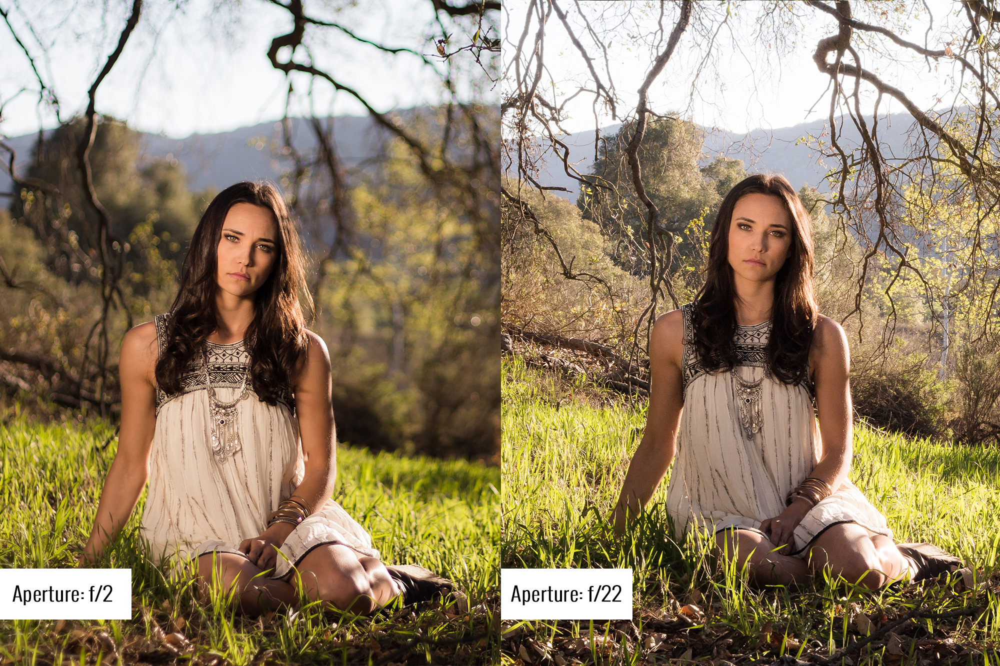

# Video Setup for Recording Humans

_<mark style="background-color:orange;">**Don't forget to charge your batteries and check your SD cards before your shoot!**</mark>_

## Setting Physical Dials

* Set Mode Dial to C1 (custom mode 1)

_<mark style="background-color:yellow;">This mode has already been preset with the optimal settings for the type of video recording done in-class (talking head, dramatic monologue, etc</mark>_

* Set Focus Mode Dial to C (continuous)

<figure><figcaption></figcaption></figure>

## Set Autofocus (AF) Type

1. Press the autofocus button on the back panel of the camera, inside the focus mode dial.
2. Select Full Area ( Human Detection )
   1. _**If**_ you don't see "Human" as an option for any AF type, then toggle it on by pressing the "AF Detection On/Off" button on the LCD screen
3. Press the set button on the LCD Screen

<figure><figcaption></figcaption></figure>

_<mark style="background-color:yellow;">We have found this to be the best AF Type   vlogging, monologues, any video setup where a relatively stationary camera is recording in front of on one or two people.</mark>_&#x20;

## Set Metering Type (evaluating exposure)

1. Enter the quick menu by pressing the small button labeled "Q" on the back panel of the camera.
2. Select the icon for metering (highlighted in yellow in the picture below)
3. Select the icon on the left for multi-metering (also in yellow)

<figure><figcaption></figcaption></figure>

_<mark style="background-color:yellow;">**Metering Modes**</mark> <mark style="background-color:yellow;"></mark><mark style="background-color:yellow;">determine how the camera determines the correct exposure for the scene.</mark> <mark style="background-color:yellow;"></mark><mark style="background-color:yellow;">**Multi Metering Mode**</mark> <mark style="background-color:yellow;"></mark><mark style="background-color:yellow;">takes into account the entire scene, but places an emphasis on the center of the frame, which is likely where your subject will be.</mark>_&#x20;

## Shutter and Aperture Settings

### Shutter Setting: Why and How

Your Custom Mode 1 settings has the camera recording at 4K, 72Mbps, 10 bit color, and **30fps**. For this reason _**your shutter should always be set to 1/60th of second.**_ This is because your shutter speed denominator is always set to twice the value of your fps or frames per second. So a 24 fps (cinematic) would require a shutter speed of 1/50th. A 60 fps (hyper-real) require a shutter speed of 1/120th, and so on

**To set your shutter speed to 1/60th** turn the **rear dial** until you see the number 60 in the lower right of your LCD display

<figure><figcaption>
Front dial (purple) sets Aperture and Rear dial (green) sets Shutter.
</figcaption></figure>

### **Aperture Setting**

The aperture setting (denoted by f/ number) determines the depth of field of your shot, with lower numbers indicating a shallow depth of field (blurry background, sharp subject) and higher numbers a deep depth of field (both foreground and background relatively in focus with subject staying sharp).

<figure><figcaption></figcaption></figure>

**We recommend setting your aperture between f/4.0 and f/8.0** so that there is a better chance of your entire subject being in focus even if they move a bit. &#x20;

**Set your aperture by turning the front dial** (or shutter dial) until you fall somewhere in that range. Your aperture setting is displayed on the bottom of the LCD panel to the right of your shutter setting&#x20;

<mark style="background-color:yellow;">Tip: if you are in a darker setting, use a smaller aperture number. the smaller the number, the more light is let into the camera</mark>&#x20;


[audio-set-up.md](audio-set-up.md)

