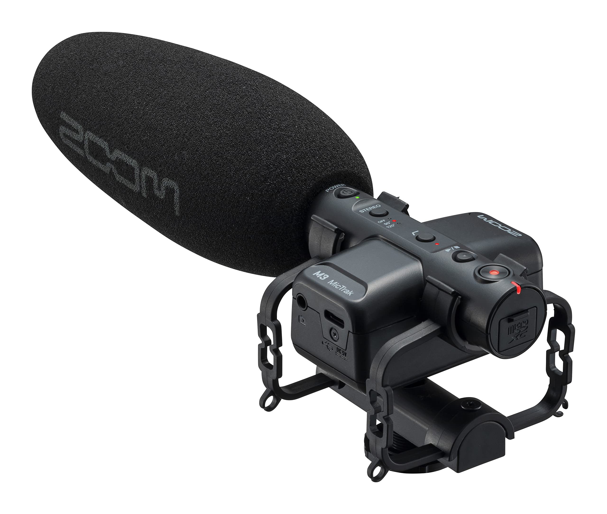
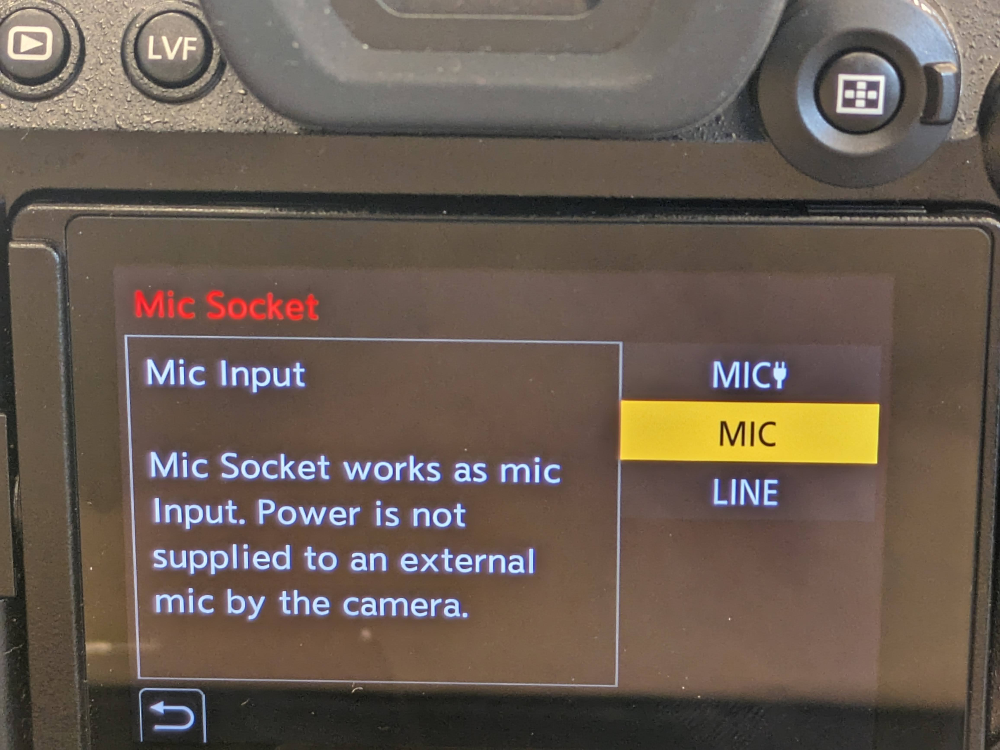

# Audio Set Up

_<mark style="background-color:orange;">**Don't forget to check out the section on setting audio levels below**</mark>_

## Option 1: Zoom M3 Shotgun Mic for General Audio

<figure><figcaption></figcaption></figure>

 

<figure><figcaption>
Left to Right: Wind Screen, Microphone, 3.5mm cord, Shock-Mount
</figcaption></figure>

The zoom M3 is a both a microphone and a stand alone audio recorder. The following settings use the M3 as a microphone only, meaning the camera will record the audio. If you want to find out more about using the M3 as an audio recorder for full 32 bit audio, [watch this video](https://youtu.be/503QnDhkzqQ?si=It2kCdE0NYQBLpHQ).

### <mark style="background-color:yellow;">Physical Installation</mark>

1. Make sure the microphone has batteries in it and turns on. There are rechargeable AA batteries in the kit. Turn the microphone off when not actively recording.&#x20;
   1. slip on windscreen if recording outside or in noisy area
2. Install the shotgun mic into the shock-mount holder&#x20;
3. Install the shock- mount onto the hotshoe of the camera by sliding it in and turning the wheel at the base until it is firmly secure
4. Take the 3.5mm cord and plug it into both the microphone and camera in the appropriate 3.5mm jacks

<figure><figcaption></figcaption></figure>

### <mark style="background-color:yellow;">On mic buttons</mark>

<figure><figcaption></figcaption></figure>

**Choose between 90 degree or 120 degree microphone pattern**. 90 is more focused in and narrow pick-up pattern, where as 120 is wider.&#x20;

If it is particularly windy or if there is alot of background noise in the lower range you can **enable the low-cut filter to dampen that noise**

### <mark style="background-color:yellow;">**In Camera Settings (Zoom Shotgun)**</mark>

Enter the camera menu by pressing the Menu/Set button in the middle of jog wheel on the back panel of the camera.

<figure><figcaption></figcaption></figure>

Then navigate to: Audio 1 > Mic Socket > Mic

This is the correct setting because the Zoom M3 provides its own power via the AA batteries

<figure><figcaption></figcaption></figure>

 

<figure><figcaption></figcaption></figure>

## Option 2: Lav Mic for Recording an Individual Subject

### Setting up the Lav

Ask your subject to remove any earrings, jewelry, or other items that may make noise or ruffle the lav mic

Clip the lav mic on your subject's clothes 6-8 inches below their chin.&#x20;

<figure><figcaption></figcaption></figure>

 

<figure><figcaption></figcaption></figure>

 

<figure><figcaption></figcaption></figure>

Untangle the cord and plug the 3.5mm plug into the corresponding 3.5mm jack on the camera's left side, labeled "mic"

<mark style="background-color:red;">Make sure their is no tension on the cord, and leave plenty of slack in case your subject moves significantly. A tense cord could lead to audio issues or damage to the camera</mark>

<figure><figcaption></figcaption></figure>

### In Camera Settings (Lav Mic)

Enter the camera menu by pressing the Menu/Set button in the middle of jog wheel on the back panel of the camera.

<figure><figcaption></figcaption></figure>

Then navigate to: Audio 1 > Mic Socket > Mic Plug-in Power

The Lav Mic requires additional power (also called plug-in power), which is why this is  correct setting.

<figure><figcaption></figcaption></figure>

 

<figure><figcaption></figcaption></figure>

