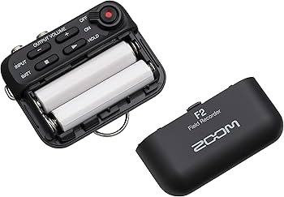
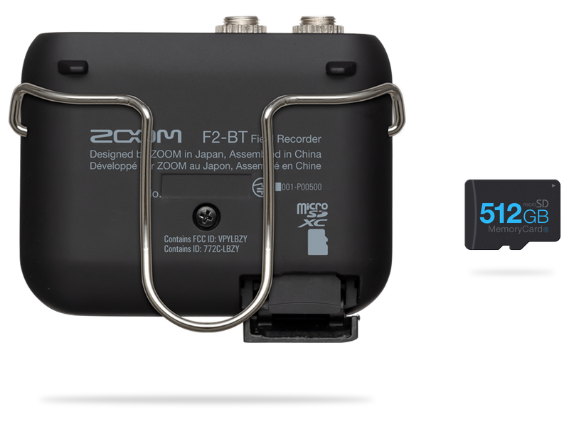
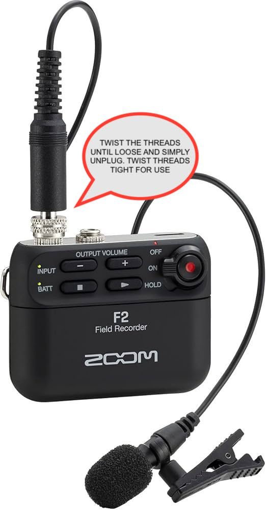
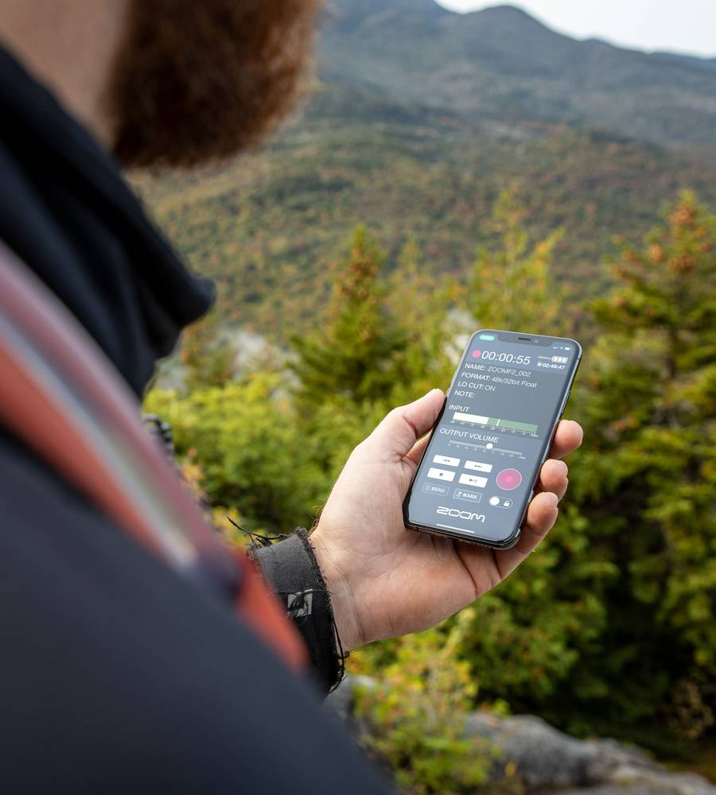

# Field Recorder

The Zoom F2-BT field recorder contains a lavalier microphone and compact battery powered mic-pack that is perfect for interview, discrete audio recordings, including capturing sound for an actor in a scene. It can be more appropriate for more advanced users as it captures 32bit Float audio, which doesn't require you to set the gain, giving you perfect audio that can be adjusted in post but will require more advanced audio editing software such as Adobe Audition to import and edit the larger files.&#x20;

It records directly to micro SD, SDHC and SDXC cards up to 1 TB

The F2 can record up to 15 hours (14 hours on the F2-BT) with two fully charged AAA batteries. (included)

[Manual](https://zoomcorp.com/media/documents/E_F2_3.pdf)

<figure><figcaption></figcaption></figure>



### Getting Started

The field recorder comes with

* The Zoom F2-BT Mic Pack
* The Lav Microphone with Clip and Windscreen
* Headphones
* 4 AAA rechargeable batteries and battery charger&#x20;
* A MicroSD card (no doubt inside the mic pack)
* A MicroSD Adaptor&#x20;
* A USB C Chord&#x20;

Once you have located all the parts, you should first ensure that your batteries have received enough charge. Give yourself time beforehand to do so.&#x20;

<figure><figcaption></figcaption></figure>

The Batteries are inserted from the front. Place your thumb gently just below the play button and slide gently downward to unclip.&#x20;

Next ensure you have a microSD card inserted

<figure><figcaption>
This has no SD card inserted
</figcaption></figure>

Gently open the SD card slot. You should see the end of the MicroSD card sticking out at the top, which is not seen in this above image. Click the SD card to release it, click it back in to secure it.&#x20;

Once you have verified that you have an SD card and charged batteries, all you need is to attach the lavalier microphone if its not already attached.&#x20;

<figure><figcaption></figcaption></figure>

### Mic Placement&#x20;

For video projects (or audio only) where the mic visibility is not a factor, clip the mic approximately 6-8 inches away from its source. On a person this could be accomplished on the lapel of a shirt or simply below on any fabric. **For consideration of your subject's body autonomy it may be advisable to ask them to do it themselves and instruct them if you'd like it closer or further away.**&#x20;

For video projects where you would not like the mic to be visible, the mic can capture good audio by being placed inside a jacket along the lapel, or even under a layer of clothes. If you need to assist your subject be sure to proceed with care and asking consent, and leave them the option to set the mic themselves in private. The mic cord can trail down the inside back or inside side of their clothing and the mic detached and reattached to the mic pack which can then be hidden in a pocket of clipped on a belt.&#x20;

### Bluetooth Remote Recording&#x20;

<figure><figcaption></figcaption></figure>

The F2 BT is enabled with Bluetooth to remotely record from your phone.&#x20;

This is especially useful when recording subjects so that you can remotely start and stop the recording. **Just make sure the F2 BT does not have the "HOLD" switch enabled.**&#x20;

You'll first need to download the F2 Controller App on your phone or tablet.&#x20;


For reference also in the Apple App Store


Make sure your bluetooth is activated in your phone or tablet settings and open the F2 Controller App. Make sure to turn on the F2 BT mic pack so that it picks it up in the bluetooth settings.&#x20;

You also may use the enclosed USB cable to link to your computer and adjust settings using the same downloadable app.&#x20;

&#x20;You'll be able to adjust the record format setting as well as enabling a 80HZ low-cut filter for ambient noise, such as an air-conditioning unit or the constant sound of a highway interchange.&#x20;

The low-cut feature is mostly useful for recording the sound of people talking since it is unlikely to  limit anything in the range of the human voice.&#x20;

You should not enable the low-cut feature if you're recording general ambient noise and want to pick up the environment as it naturally is.&#x20;

### Finishing Up

* Use the enlosed transfer cable to import your sound files into your computer.&#x20;
* Turn the F2 BT on to initiate transfer.&#x20;
* Back-up your files and format/delete the files on the SD card before returning it so that you keep your files private.&#x20;
