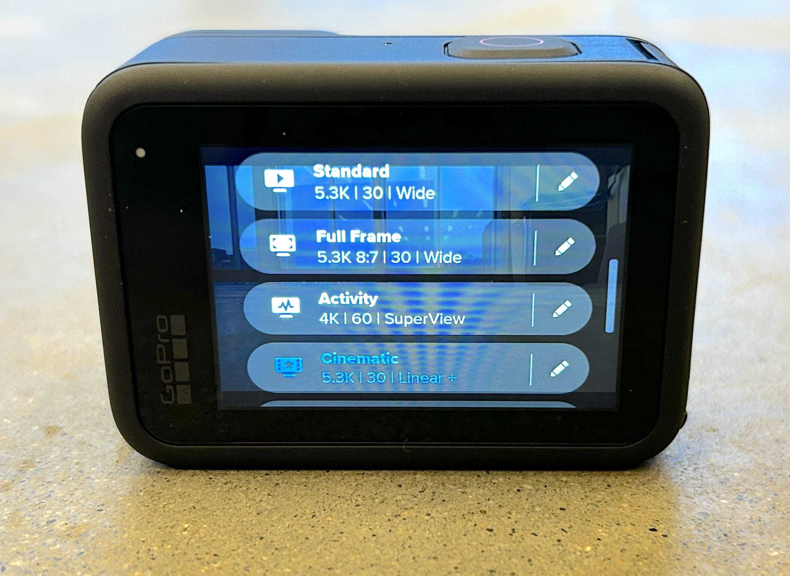

# GoPro Kit

## Included in the Kit:

* GoPro
* Battery (x2)
* Battery Charging Case
  * USB-C Charging Cable
  * USB Block
* 128gb MicroSD Card
  * MicroSD to USB-C adapter
* Magnetic Joby GorrillaPod
* Head Mount
* Hand Grip
* Flexible Grip Mount

<figure><figcaption>
Most of the accessories should be stored in the main bag as shown (left), while the GoPro, Charger, Charging Block, Cords, and Joby Tripod should go in the smaller case that fits inside the main bag as well. 
</figcaption></figure>

## Quick Start Guide

Below is a helpful 10min video that will demonstrate the basic functions and operations of using the GoPro Hero11 Black. There are a few things to note, however:

* <mark style="background-color:orange;">**Never remove the side door**</mark>&#x20;
* <mark style="background-color:orange;">**Never remove the lens hood**</mark>&#x20;
* Though you can charge the battery in the GoPro, we recommend using our included external charger which will charge both kit batteries simultaneously.&#x20;
* While we don't recommend using the Quik app for transferring files, it can be useful for things like live viewing your shot on your phone, changing settings on the Go Pro after it has been mounted, and other remote functions


For an overview of the menus skip ahead to 3:35


The power button can be found on the side of the camera. Press or hold it to turn on the camera. To turn off the camera, hold it down for three seconds.

<figure><figcaption></figcaption></figure>

## Basic GoPro Operations&#x20;

For the basics of using the camera, swipe left or right to switch between timelapse, video, and photo modes. The mode you are on should pop up on the center of the screen. Once you are on your selected mode, use the large button on the bottom of the screen to switch between capture setting presets. The pre-built presets include modes such as "Cinematic" for more traditional, 30-frames-per-second video, "Activity" for ultra-wide, 60-frames-per-second video, and "Ultra Slo-Mo" for wide, 240-frames-per-second video.&#x20;

Once you have selected your intended mode and capture settings, just press the record button on the top of the screen. Press the button again to stop recording.

<figure><figcaption>
Menu Overview
</figcaption></figure>

 

<figure><figcaption>
Selection of Capture Setting Presets for Video Mode
</figcaption></figure>

### Playblack

To review your recordings on the gopro , swipe up from the bottom of the screen to view media playback. For a more in-depth guide on how to use the camera menus, check out the video above!

### Batteries/Charging

To access the battery door, pull down firmly the lever on the side of the camera to unlock the door. <mark style="background-color:orange;">**Make sure it's the side that does not have the power button**</mark>! Be aware that the lever can be tricky to pull down. Once the lever is unlatched, the door should pop open, and you will have access to the battery/media section.&#x20;

Use the white tab on the battery to pull it out. <mark style="background-color:orange;">**When putting batteries back in, be sure to align the metal pins on the battery with the metal pins in the GoPro's battery receiver**</mark><mark style="background-color:orange;">.</mark>

<figure><figcaption>
Try using your fingernails to grip the lever
</figcaption></figure>

 

<figure><figcaption>
Battery/Media Compartment
</figcaption></figure>

To charge the batteries, use the included battery charger, which can charge both batteries at once! The kit also includes a USB-C cable and block adapter to plug the battery charger into the wall.

<figure><figcaption></figcaption></figure>

### Transferring Media

The GoPro kit comes with a 128 gb Micro-SD card included in the camera. Once you are done filming, you need to back up the footage onto your personal computer/hard drive before you return the kit. You can also use the the computers in the[ Multimedia Labs](https://www.brown.edu/go/mml) to transfer files to a google drive/drop box

To transfer the footage, begin by removing the Micro-SD card. You can access the card slot in the same door that houses the battery as described above. Use your fingernail to press down on the card, and the card should pop up enough for you to remove it from the camera. <mark style="background-color:orange;">**Be very careful with the card since it is small and easily lost!**</mark>

<figure><figcaption></figcaption></figure>

To plug the card into a computer, the kit includes a Micro-SD card reader that can be plugged into any MML Computer or laptop via USB-C (there is also a USB-A connection on the other side of the card reader). The adapter is attached to the case that houses the GoPro and battery charger. To use it, you need to first remove the black cap that protects the USB-C port. Make sure not to lose this piece either! Then just plug the adapter into your computer, and you should be set to transfer footage onto your personal hard drive.

<figure><figcaption></figcaption></figure>

## Accessories

### Attaching to Accessories

All of the included accessories attach to the GoPro the same way. To access the GoPro's mount, flip out the tabs at the bottom of the GoPro. Then slip the GoPro into the accessory as pictured and tighten it down with the mounting screw. The mounts also let you tilt the GoPro up or down to achieve the angle you desire!

<figure><figcaption>
Flip out Mounting Tabs
</figcaption></figure>

 

<figure><figcaption>
Slide into accessory
</figcaption></figure>

 

<figure><figcaption>
Use the screw to secure the mount!
</figcaption></figure>

### Joby GorrilaPod

The GorrilaPod works as a table-top tripod, letting you set up the GoPro for static shots. It is best used for time lapses, live-performance videos, or any other shots where the camera doesn't need to move. Use the ball head at the top of the tripod to adjust the angle of the camera. The red tips of the Gorrila Pod are magnetic, so they will affix to metal walls. <mark style="background-color:orange;">**While the magnetic grip is strong, it is not suitable for moving surfaces (door swings, car hoods, etc) and will likely fail leading to damage of the camera**</mark>

<figure><figcaption>
Joby GorillaPod with GoPro
</figcaption></figure>

 

<figure><figcaption>
Ball head for adjusting camera angle
</figcaption></figure>

### Head Mount

The head mount allows you to capture point-of-view footage for action sports, vlogging, or anything else you can think of. Just use the adjustable straps to fit the GoPro to your head.

<figure><figcaption></figcaption></figure>

### "The Handler" Floating Hand Grip

"The Handler" gives you a large grip to capture handheld footage with the GoPro. For instance, you can face it towards you for vlogging or away to capture point-of-view footage. The grip can also float in water if you want to capture any footage around water, although always make sure to use the wrist strap when using the hand grip around water!

<figure><figcaption>
The Handler
</figcaption></figure>

### Flexible Grip Mount

The flexible grip mount is a versatile mount that lets you attach the GoPro to a variety of irregularly shaped objects. As in the pictures here, you can attach it to poles or railings, but feel free to try it on any objects at your location. If it can wrap around the mounting point, it should be strong enough to hold the GoPro up!

<figure><figcaption></figcaption></figure>

 

<figure><figcaption></figcaption></figure>

