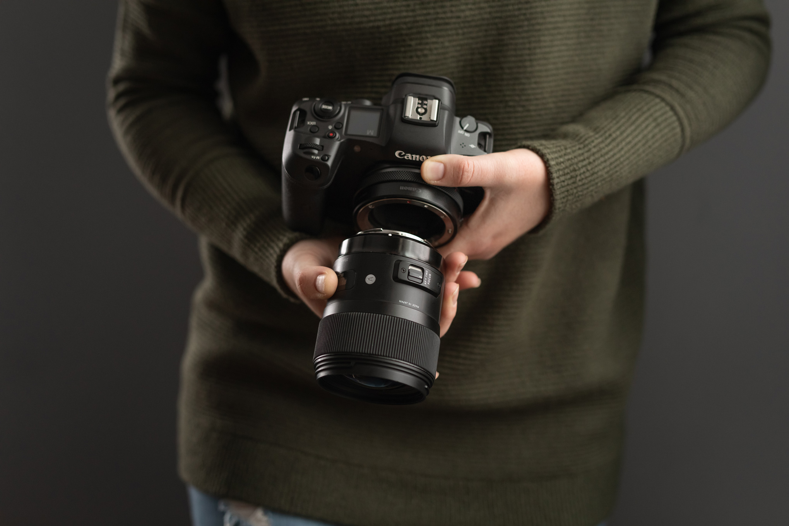
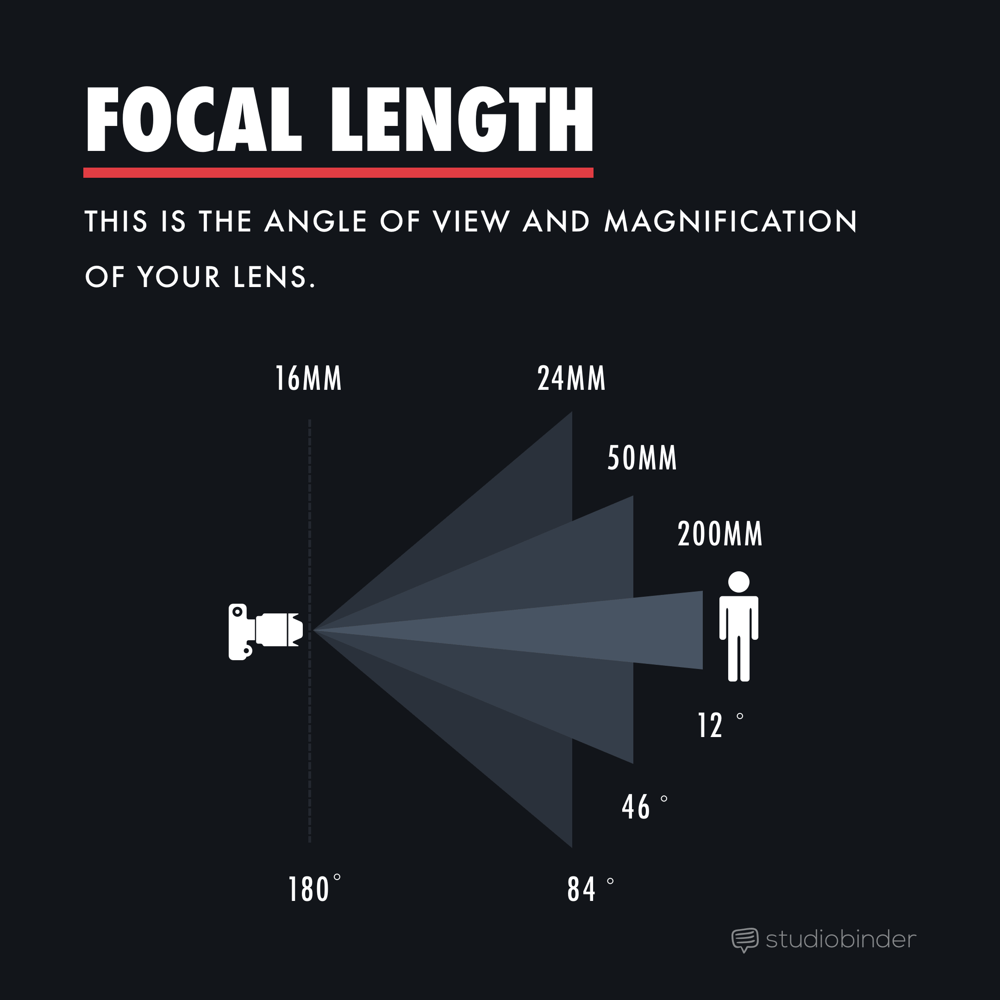
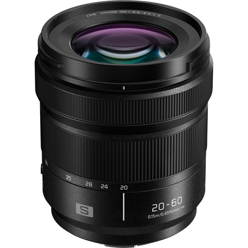
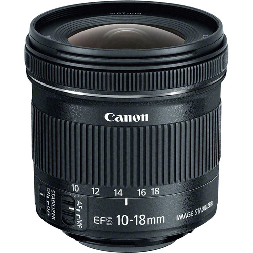
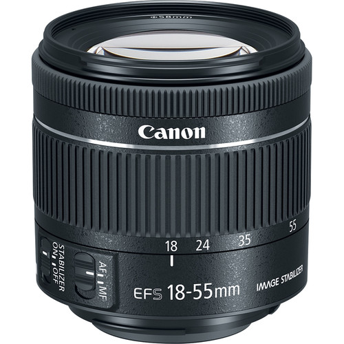
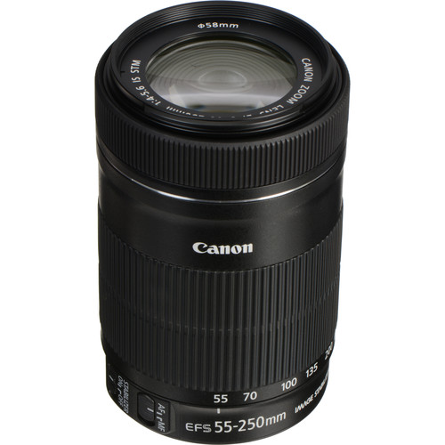
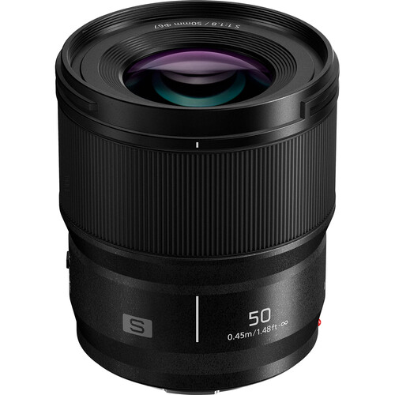
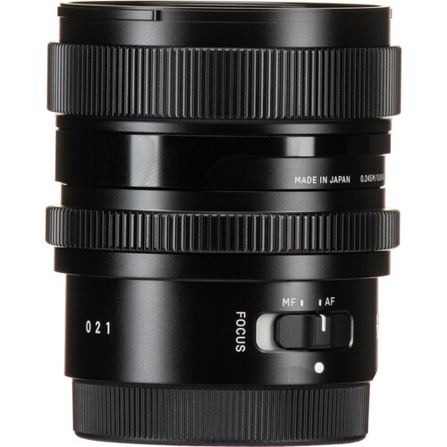

# Lens Choices for Lumix Camera

<figure><figcaption></figcaption></figure>

## Why different lenses?

**We'll tell you, but first...a few points:**&#x20;

* Lenses are defined as either **Zoom or Prime Lenses**. Zoom or "Variable" lenses have adjustable focal lengths while Prime lenses have a fixed length.&#x20;
* Measured in millimeters (mm) a **focal length** is the magnification capability of the lens which determines how much of the scene is visible.&#x20;
* The focal length also affects, as a result of perspective, the perceived distance of the background relative to the subject. The longer the focal length, the closer the background will appear. A shallower depth of field (a more narrow field of focus) can be achieved by using a wider aperture (a lower number f-stop) or a longer focal length (a higher number like 200mm seen below)&#x20;

<figure><figcaption>
<strong>Left: 200mm f/4 | Middle: 70mm f/4 | Right: 24mm f/4</strong>. - the "F" is the f-stop adjustable to a varying degree on different lenses also known as <strong>the aperture</strong> or what light is let in. <em>Reminder: The Focal length is the 200mm, 70mm etc</em>
</figcaption></figure>

<figure><figcaption></figcaption></figure>

## So, why different lenses?&#x20;

Using different lenses achieves vastly different effects of perspective that imply different moods, different intensity and different focus for the viewer. It also allows you to shoot from the distance you wish so that you are neither too far or too close to the actor or the subject.&#x20;

As you can see, the aperture range, or the maximum (which is a lower number) varies depending on the focal length used in the zoom lenses i.e. f/3.5 to f/22 for the 20mm to 60mm kit lens described below. Whereas the prime lens has a fixed maximum, hence the one number such as f/1.8. Keep this in mind when choosing a lens when deciding to shoot in low-light conditions. The lower the number the larger the aperture, the more light is let in, making it better for low-light or nighttime shooting.&#x20;

### The lenses in detail

_<mark style="color:purple;">The photos below were all taken from the same distance, unzoomed in the case of the zoom lenses, so at the first focal length.</mark>_&#x20;

_<mark style="color:purple;">Additional note: The ones requiring an adaptor are available for check-out along with the lens.</mark>_&#x20;

The first lens, that comes with the Lumix (the kit lens) is a

**Panasonic Lumix 20mm-60mm**&#x20;

<figure><figcaption></figcaption></figure>

<figure><figcaption>
un-zoomed Lumix 20mm-60mm
</figcaption></figure>

Aperture Range: f/3.5 to f/22

This is a zoom lens covering a wide range of focal lengths, from ultra wide to short portrait length fields of view. Unique in its focal length range.

### Lenses available for Checkout

**Canon EF-S 10-18mm (adapter required)**&#x20;

<figure><figcaption></figcaption></figure>

<figure><figcaption>
Canon 10-18mm
</figcaption></figure>

Aperture Range: f/4.5 to f/29

Flexible wide-angle zoom lens

"The [wide-angle lens](https://www.masterclass.com/articles/how-to-use-a-wide-angle-lens-in-your-photography) is ideal for fitting a large object into the frame or drawing attention to an object in the image’s foreground. Wide-angle lenses can show greater movement and scope within a scene and exaggerate and distort the foreground image. Certain lenses can produce an ultrawide-angle or even fish-eye effect if their focal length is larger than the camera’s sensor size." - from Masterclass

**Canon EF-S 18-55mm (adapter required)**

<figure><figcaption></figcaption></figure>

<figure><figcaption>
Canon 18-55mm
</figcaption></figure>

Aperture Range: f/4 to f/32\
Versatile and standard, this lens covers wide-angle to portrait-length perspectives.

\

**Canon EF-S 55-250mm (adapter required)**

<figure><figcaption></figcaption></figure>

<figure><figcaption>
Canon 55-250mm (compare to the previous lens which ends at 55 instead of starting) 
</figcaption></figure>

Aperture Range: f/4 to f/32

This is a telephoto zoom lens suitable for distant subject matter.

\

**Panasonic Lumix S 50mm F/1.8 (native L-mount)**

<figure><figcaption></figcaption></figure>

<figure><figcaption>
Lumix 50mm
</figcaption></figure>

Prime (fixed focal length) lens, suited for both portraits and landscape. With a F/1.8, this lens provides a bright, shallow depth of field that’s good for low light photography. This is a popular lens for filmmakers.&#x20;

"Known as the “nifty 50,” the 50mm lens is a prime lens that can represent how the human eye sees objects and people in a natural setting. They are both affordable and lightweight, making them ideal for handheld filmmaking. However, first-time users should consider using <mark style="background-color:red;">stabilizers\*</mark> or gimbals (pivoting support for [camera operators](https://www.masterclass.com/articles/film-careers-how-to-become-a-camera-operator)) for greater image stabilization. A 50mm lens can also create the bokeh effect, a soft, attractive, out-of-focus background image, with maximum aperture." - from Masterclass

<mark style="background-color:red;">\*an action pan is available in cheqout but the lumix also has built in digital stabilization features. Still, a good factor to consider.</mark>&#x20;

\

**Sigma 24mm F/2 (native L-mount)**

<figure><figcaption></figcaption></figure>

<figure><figcaption>
a little dark however...this is the operator and not the lenses fault, unless that's what we were going for? Maybe...
</figcaption></figure>

Prime (fixed focal length) lens, this is a wide angle lens ideal for landscape and architectural photography. At F/2, this lens provides a bright, shallow depth of field that’s good for low light photography.&#x20;

### IN CONCLUSION

Consider your lens choice based on the requirements of your shoot. A zoom lens allows you great flexibility to shoot both close-ups and wide shots without having to change lenses, which is already provided with the Lumix Camera Kit, but consider your shot-list\* ahead of time to see if you wouldn't benefit from the other available lenses, even for a single shot. The difference in effect can be worth it.&#x20;

\*a list of shots, storyboarded\*\* or not, to keep track of your film shoot.&#x20;

\*\*a visual comic of the shots required in a shoot, often roughly drawn and indicating motion, framing, and other factors.&#x20;

### 

### LENS CARE

Make sure to cap your lenses when not in use. Be extra careful of any surfaces or objects which may come into contact to scratch the lens. When not immediately changing a lens over, take care to cover the lens mount as well. Place them in their protective pouches when not in use, and store them carefully in a protective bag or in a safe place.&#x20;

<mark style="background-color:red;">IN PROCESS</mark>

\

\
