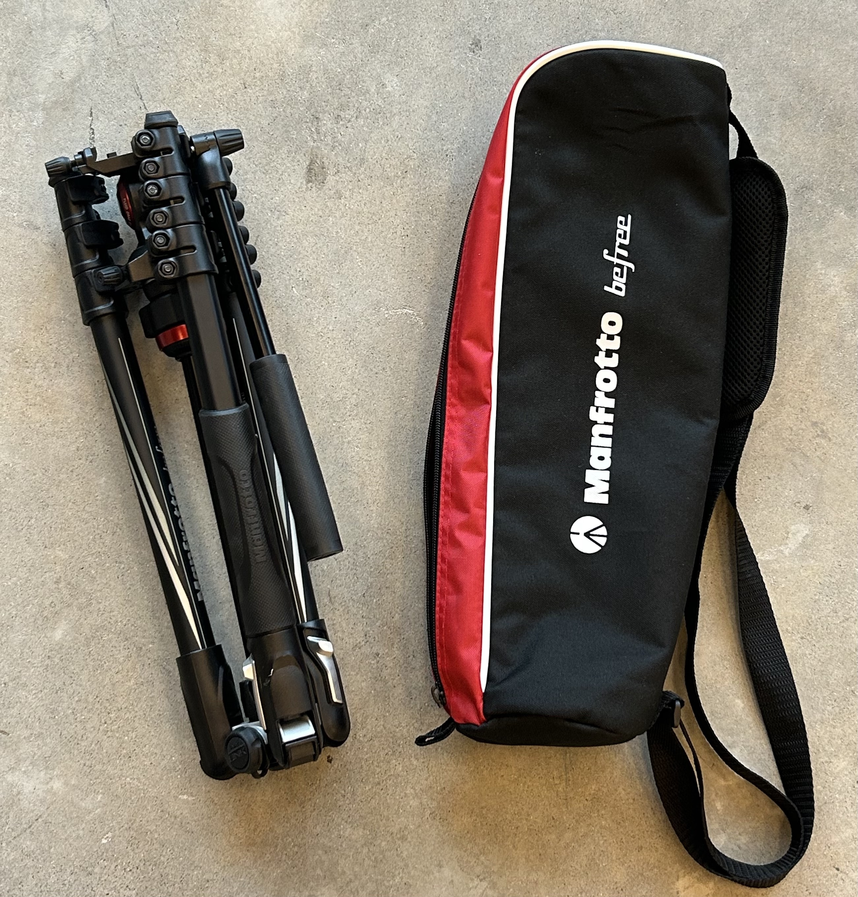
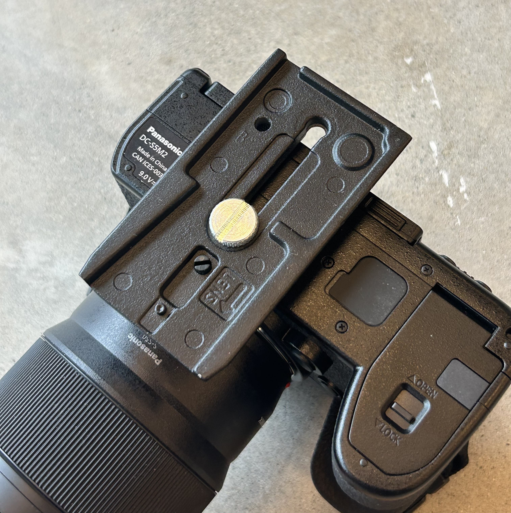
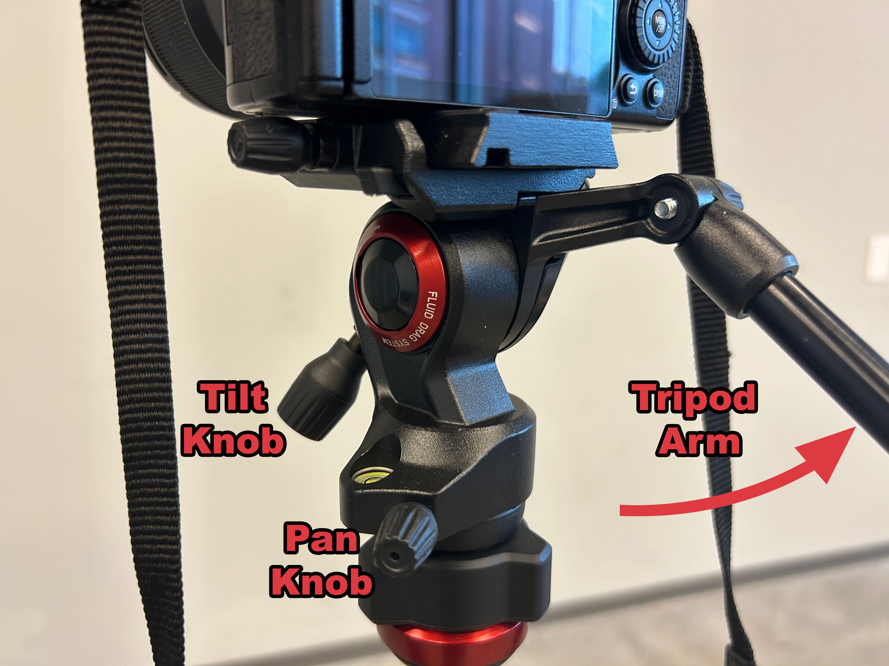
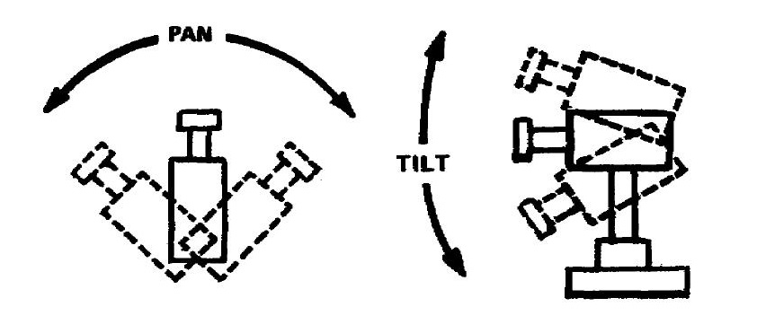
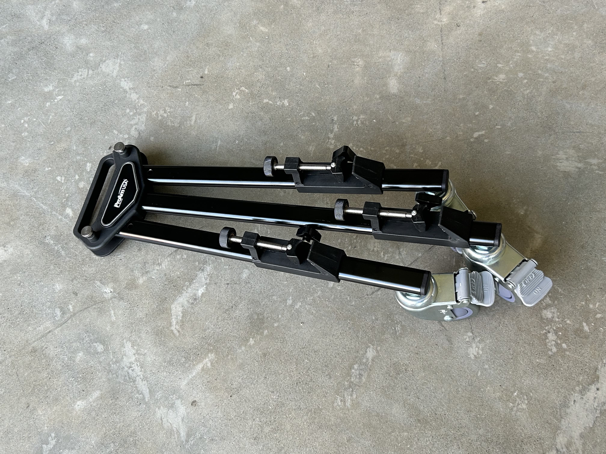
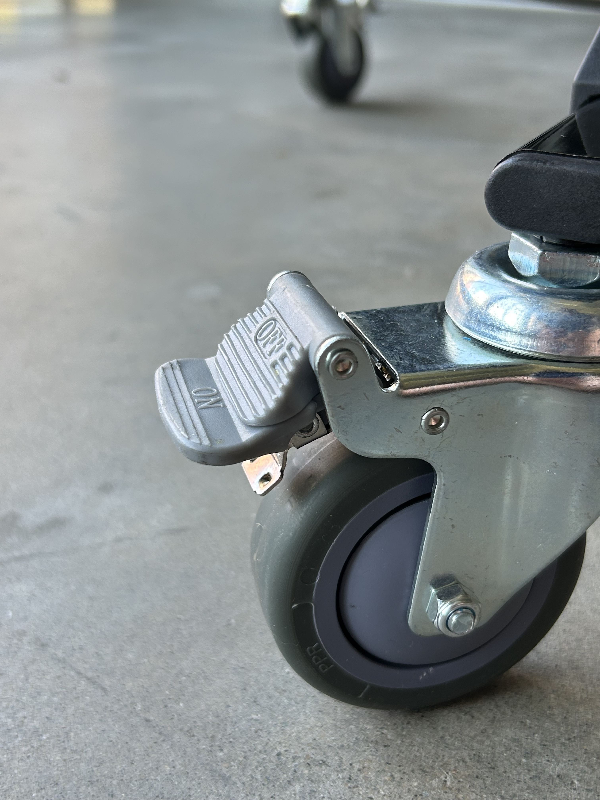
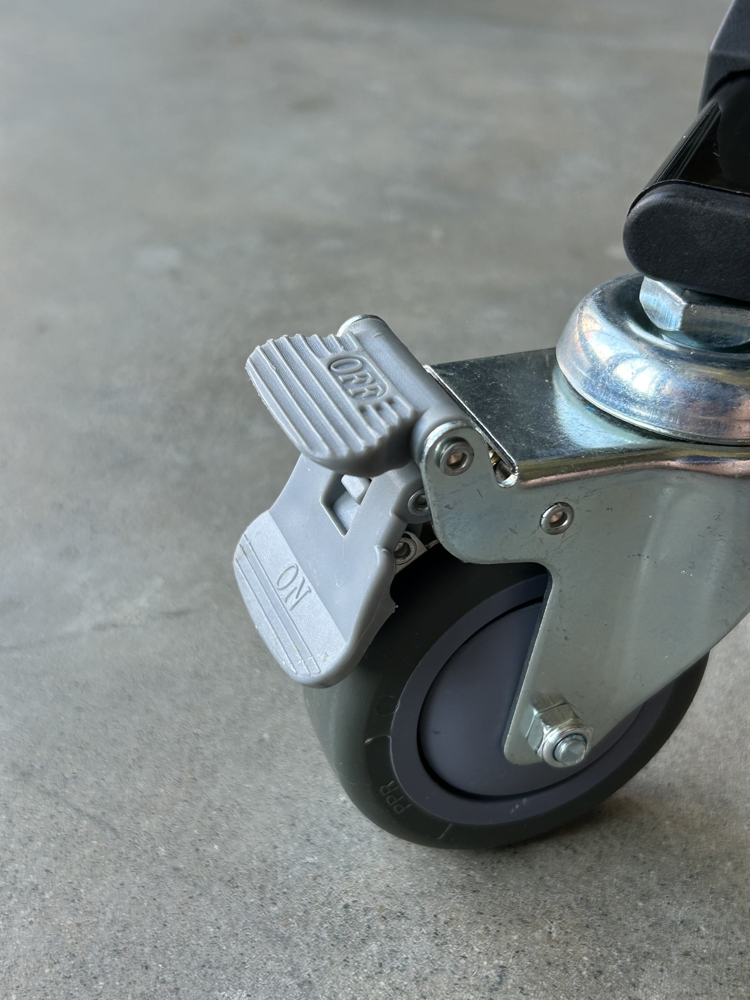
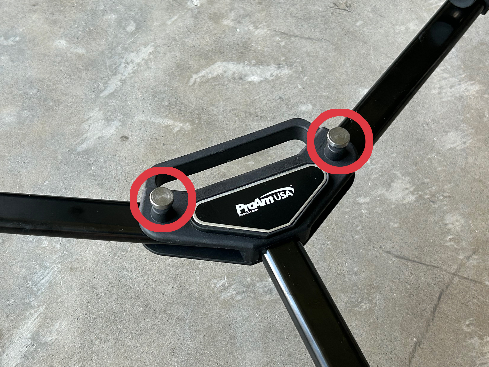

# Manfrotto Befree Tripod

### Setting up the Tripod

When you initially take the tripod out of its carrying case, it will be folded up for travel. The first step in setting up the tripod is to pull down the three legs. As you pull down each leg, you should hear three clicks, which means that the legs are in place.&#x20;

<figure><figcaption></figcaption></figure>

 

<figure><figcaption>
When all three legs are down, the tripod can stand on its own.
</figcaption></figure>

The next step is to adjust the tripod to the desired height. Each of the three tripod legs has three expandable sections that can easily be adjusted with the levers near the feet of the tripod. To raise the legs, just flip out the levers, raise the tripod, and push the levers back down to lock the tripod at the desired height. When adjusting the legs, make sure that all three legs are expanded equally so the tripod stays level and upright. Additionally, the center column can also be raised or lowered by twisting the knob at its base. Just twist the center knob counterclockwise to unlock and clockwise to lock it back at the desired height.

<figure><figcaption>
Expanding tripod legs
</figcaption></figure>

 

<figure><figcaption>
Expanding/contracing center column
</figcaption></figure>

 

<figure><figcaption>
Surprisingly tall at full height!
</figcaption></figure>

The last step before putting the camera on the tripod is to ensure that the tripod head is level. To check whether the head is level, there is a handy bubble level on the tripod head. If the head is not already level, you can use the knob at the base of the head to adjust its positioning. As previously, you twist the knob counterclockwise to loosen and clockwise to tighten once the bubble level indicates that the head is level.&#x20;

<figure><figcaption></figcaption></figure>

 

<figure><figcaption>
Levelling the tripod head takes both hands.
</figcaption></figure>

### Attaching and Positioning the Camera

Before you can put the camera on the tripod, you need to ensure that the tripod plate is securely attached to the camera. If the plate is not already attached or needs to be tightened, use a screwdriver or coin to secure the screw into the hole on the bottom of the camera. Tighten the plate until you cannot wiggle it with your hands.

<figure><figcaption>
Double check that the arrow is pointing towards the lens so the plate slides on correctly.
</figcaption></figure>

Now you are ready to put the camera on the tripod! To do so, just slide the plate onto the head of the tripod with the lens facing away from the tripod handle. If the plate does not slide on, try loosening the knob on the left side by twisting it counterclockwise to loosen. Once the camera is in position, twist the knob clockwise to secure the camera to the tripod.&#x20;

<figure><figcaption></figcaption></figure>

Now that the camera is on the tripod, you can frame up your shot. Tripods give you two axes on which to change the camera angle: horizontally (pan) and vertically (tilt). Loosening the pan knob allows you to turn the camera horizontally, left and right. Loosening the tilt knob allows you to turn the camera vertically, up and down.  As well, if you loosen the knob attached to the tripod arm, you can move the arm out to give you better control over the pan and tilt. Once you have the shot framed to your liking, tighten down the pan and tilt knobs so that the camera will stay where it is.

<figure><figcaption></figcaption></figure>

 

<figure><figcaption></figcaption></figure>

### Packing the Tripod Up

1. Remove the camera from the tripod. Loosen the knob that tightens the plate, then slide the camera back out. There is also a safety release button next to the knob that you must hold down while sliding out the camera.
2. Extend the center column to its full height.&#x20;
3. Move the tripod arm down to be in line with the rest of the tripod.
4. Fully retract the tripod legs.
5. Flip the legs back up. To do so, slide down the silver tab at the top of each leg. To unlock the silver tab, you may need to first press the legs down, towards the center, before pulling them back towards the top.
6. Put it back in its bag! You've successfully used the Manfrotto Befree Tripod!

<figure><figcaption>
Hold the silver tab down while pushing the tripod legs up
</figcaption></figure>

 

<figure><figcaption>
Tripod ready to go back in its case
</figcaption></figure>

## _Optional: ProAm Floor Dolly_

The tripod kit also comes with an optional floor dolly, which allows the tripod to be easily rolled around a room or studio without needing to constantly pick it up and reposition it. We would not recommend using the dolly for moving shots unless your floor is perfectly smooth as the dolly has a tendency to produce jittery footage.

#### Setting up the Dolly:

To set up the dolly, the first step is to flip out the two side legs, similar to the tripod. When the legs are in position, you should hear a click, and they will lock in place.

<figure><figcaption></figcaption></figure>

 

<figure><figcaption></figcaption></figure>

Now you are ready to attach the tripod to the dolly. We have found that two stages of the tripod legs must be extended for the tripod legs to fit into place. As well, it may be easier and safer to attach the tripod to the dolly before putting the camera on the tripod. To attach the tripod, position each tripod leg into one of the notches around the dolly. You may need to first loosen the screws on the dolly that secures the tripod legs in place. Attaching the tripod is the trickiest part, so take your time with this step.

Once all three tripod legs are positioned on the tripod, screw down each section as far as it will go. When all three legs are properly secured, you should be able to pick up the tripod and the dolly will move with it.

<figure><figcaption>
Notch where the tripod leg sits
</figcaption></figure>

 

<figure><figcaption>
Secure the tripod leg by screwing clockwise
</figcaption></figure>

 

<figure><figcaption>
Securely attached tripod
</figcaption></figure>

Each wheel on the dolly has a locking mechanism to stop it from moving. To lock the wheels, press down on the "on" tab. To unlock the wheels, press down on the "off" tab. You are now ready to easily move the tripod around your room!

<figure><figcaption>
Unlocked
</figcaption></figure>

 

<figure><figcaption>
Locked
</figcaption></figure>

#### Packing up the Dolly:

Begin by removing the tripod from the dolly the same way you attached it. Once the tripod has been removed, you just need to fold the dolly legs back in. To do so, lift up on the silver tabs and fold the legs in, so they are all in line. The dolly is now successfully packed up!

<figure><figcaption>
Lift these silver tabs to unlock the dolly legs
</figcaption></figure>

 

<figure><figcaption>
All packed up!
</figcaption></figure>

