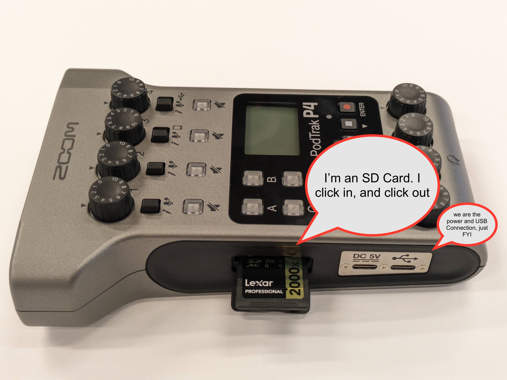
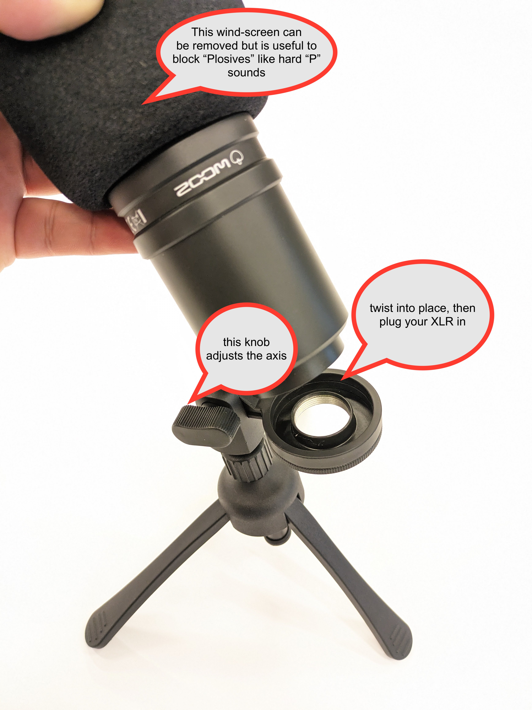
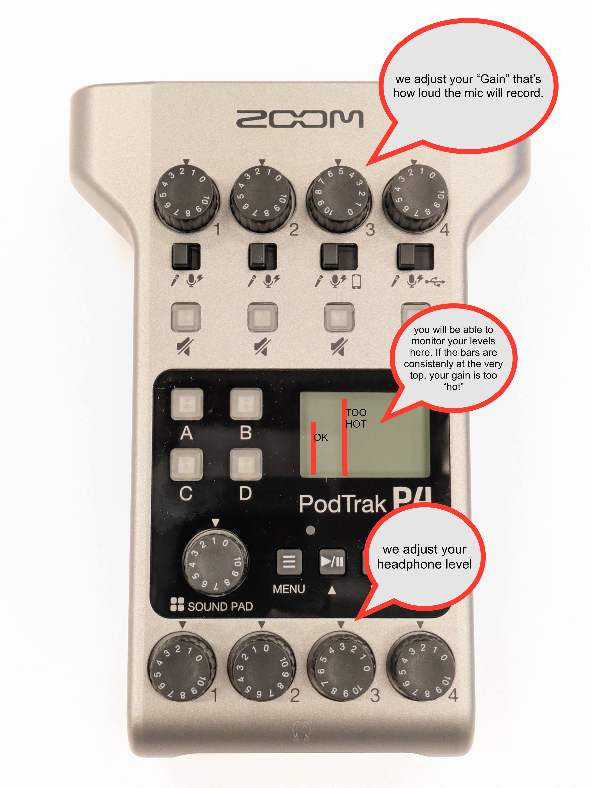
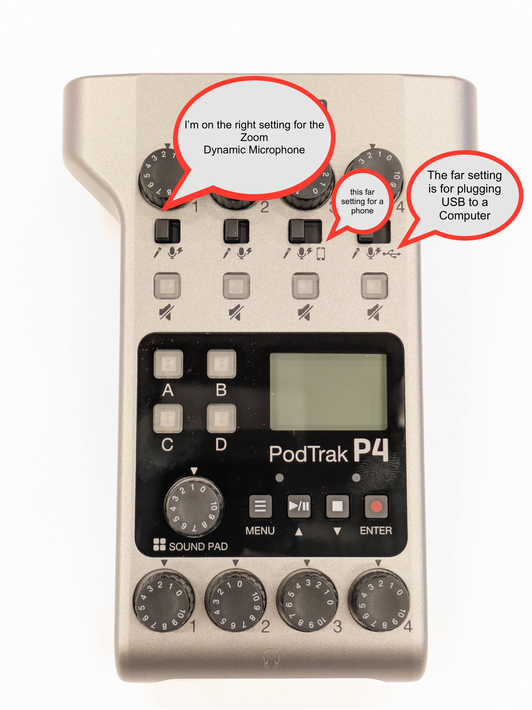

# Podcasting Kit

[PODTRAK MANUAL](https://zoomcorp.com/media/documents/E\_P4\_QuickGuide\_2.pdf)



## Overview

The Zoom PodTrak P4 is meant to be an easy plug and play interface for podcasters. It can support up to 4 different inputs including an option to record someone on a call from your smartphone using a TRRS cable or by the included USB cable to record a zoom conversation on your computer concurrently with the other microphones.&#x20;

It also can be used as an “audio interface” to record an XLR microphone and patch it into a camera that is recording while also backing up your sound on the PodTrak's SD Card.&#x20;

Thirdly, as demonstrated in the video, you could use the PodTrak as an audio interface simply to use for a Zoom meeting or any other online content. \

Your podtrack kit comes with two Dynamic Zoom XLR mics ideal for a two person podcast.&#x20;

\
These Zoom mics have a “Supercardiod” polar pattern that tends to be good at reducing ambient noise, however it’s important to stay directly in front of the mic for optimal sound. This is why you should consider additional mics for additional mic-users.

\

<figure><figcaption></figcaption></figure>

## Getting Started

Firstly locate all the parts that will be used with your Podcast P4

These include:&#x20;

1. Headphones&#x20;
2. Two Zoom Mic Desk Stands
3. Two Zoom Mics
4. Headphone Detachable Cables.&#x20;
5. Two XLR Cables&#x20;
6. USB Cord (Both to Power and Relay for upload with Computer)&#x20;
7. Batteries and Battery Charger&#x20;
8. Power Block (To be used with USB Cord to power)&#x20;
9. The main Interface (The PodTrak P4) including SD Card

<figure><figcaption></figcaption></figure>

Secondly, locate your SD card. It is probably inside the P4

<figure><figcaption></figcaption></figure>

### Formatting SD Card

Next, You should format your SD card. It is not recommended to insert the SD card while the unit is turned on, resulting in data loss. Once the SD Card is inserted you can turn it on.&#x20;

\

Press the power button on the console. It’s on the other side of where you found the SD card. If you don’t have battery power. Plug the USB cord into the DC 5V USB on the SD cord side. This should give you power.&#x20;

**IMPORTANT: Formatting an SD card will erase all of the data, so make sure to back up any important files beforehand.**

1. Insert the SD card and power on the P4.&#x20;
2. Press the Menu button, use the Play/Pause and Stop buttons to navigate to Settings, then press the Record button.
3. Use the Play/Pause and Stop buttons to scroll to SD Card and then press Enter.
4. Select Format and then select Execute.&#x20;

You’re almost ready to start podcasting! Or you know, whatever you might be up to.&#x20;

Before you do, let’s adjust one more thing in your menu screen.&#x20;

### Adjusting Low Cut/Limiter Settings&#x20;

The most important setting for audio quality is your mic setting in your menu screen. There you will see an option for “Low Cut” and “Limiter”&#x20;

Select Mic Settings on the Menu Screen

\

There you’ll see the Low Cut & Limiter functions

\

Where your XLR mic cable is plugged in should delineate with what mic number you’re using on the P4.&#x20;

\

If you’re recording in a relatively quiet space, with no humming air-conditioner or pervasive noise in the background, then you should feel free _**not**_ to activate the Low Cut function. You will get better sound quality without it.&#x20;

If your podcast is likely not to have any rapid changes in volume, such as yelling, shouting, etc, than also feel free _**not**_ to use the Limiter function. You are better off setting your gain at a good level and allowing for some variance.&#x20;

### Fastening Mic to Stand and Plugging it in

As a habit, plug in your microphone before turning on your P4. Your Zoom mic should screw on to your mic stand easily with a gentle twist. Keep twisting until it locks into place. XLR cables should click into place.&#x20;

\

<figure><figcaption></figcaption></figure>

### Setting Gain

"Gain" is how much audio information is being let into the microphone, i.e. how loud it is going to record.&#x20;

It’s important before starting any conversation, any podcast, any recording to first “check your levels.” Try to speak using a little variance into the microphone to see where a good level might be. Try starting on 5 on the gain wheel and adjusting accordingly. Speak in a realistic but soft way, and then speak in an exuberant way. Your level should lie somewhere in the middle range, on average seen on the PodTrak console screen. Occasional “peaking” where the audio passes the top bar is okay, most interfaces account for this and it shouldn’t distort your sound too badly.

\

<figure><figcaption></figcaption></figure>

### DYNAMIC VS CONDENSER SETTINGS

IMPORTANT: The Zoom Pod Mics are Dynamic microphones, therefore they do not require Phantom Power. Make sure it is on the first setting. NOT the microphone with the little electric symbol. Doing so could damage the device.&#x20;

<figure><figcaption></figcaption></figure>

### Additional Functionality

Recording Someone Through A Phone

If you plan on recording a line through your phone this will be through Channel 3. You can record through a TRRS cable (not included) that plugs into the little phone icon on the side of the PodTrak. Make sure the setting is switched to the right on the PodTrak to the phone setting on line/Channel 3.&#x20;

Recording Someone Through a Zoom or Google Chat Call

If you plan on recording a zoom conversation or something that will be relayed through your computer, use the USB cord to do so. You will have to obtain an additional USB cord if you’re not going to be using battery power. Make sure the setting on Channel 4 is set to the USB icon.&#x20;

The Sound Pad

The final bit of functionality is a sound pad which allows you to use up to 4 sounds (applause, groans etc) that can be customized. You can upload new sounds to the SD card. Please consult the manual for more detailed instructions. The sound pad volume knob is used for what you think it is.

### File Transfer

Finally, when you’re done podcasting, leave the SD card inside the PodTrak. Use the USB cord and plug it into the USB outlet and into your computer of choice. Go into Menu on the PodTrak and select File Transfer

After you’re done transferring, you will see individual files in the masterfile on your computer that include a mix of all mics that have been recorded, including any use of the sound-pad, all good and ready to go!&#x20;

Otherwise, you will also have a folder containing all individual files that can be mixed individually in the audio editing software of your choice.&#x20;

Once you have made sure that you have in your possession all needed sound files, you can format the SD card so that your private recordings are not passed on to a future user.

\

\
