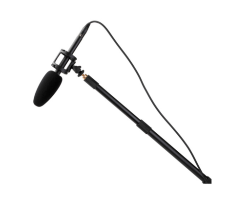
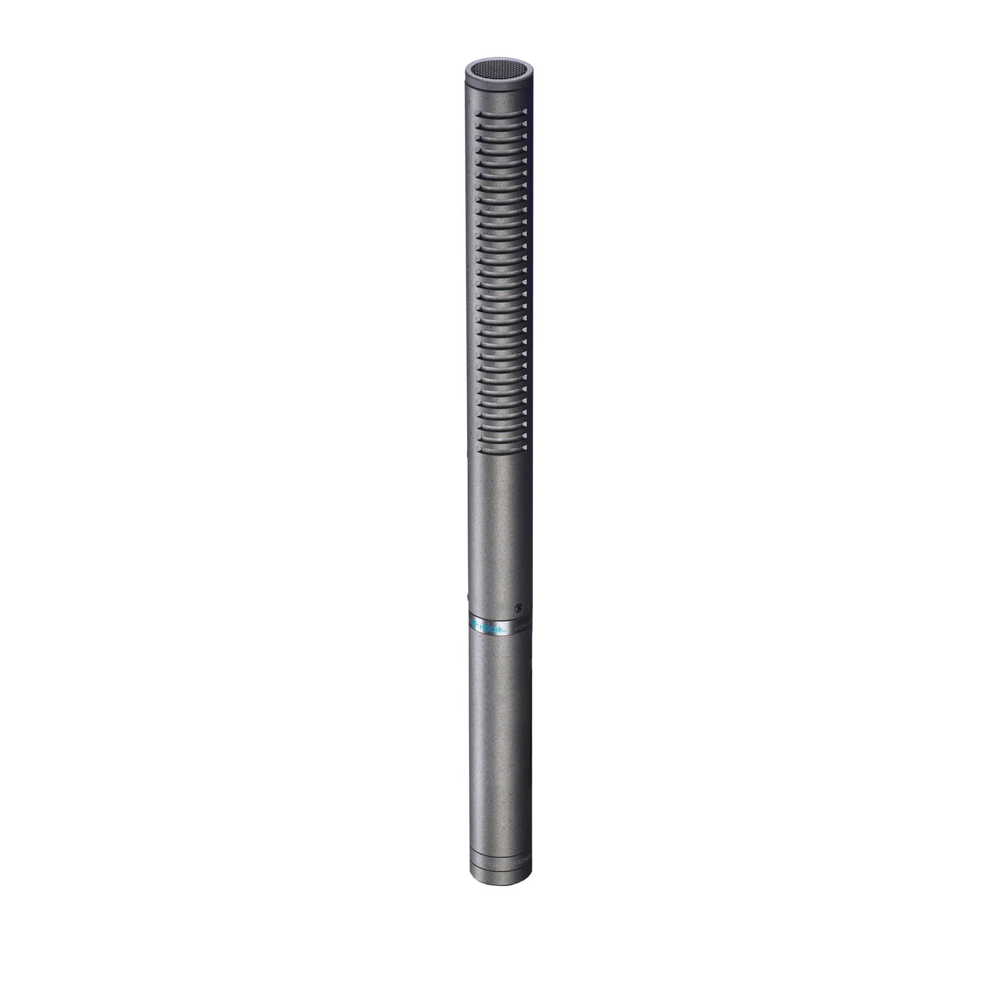
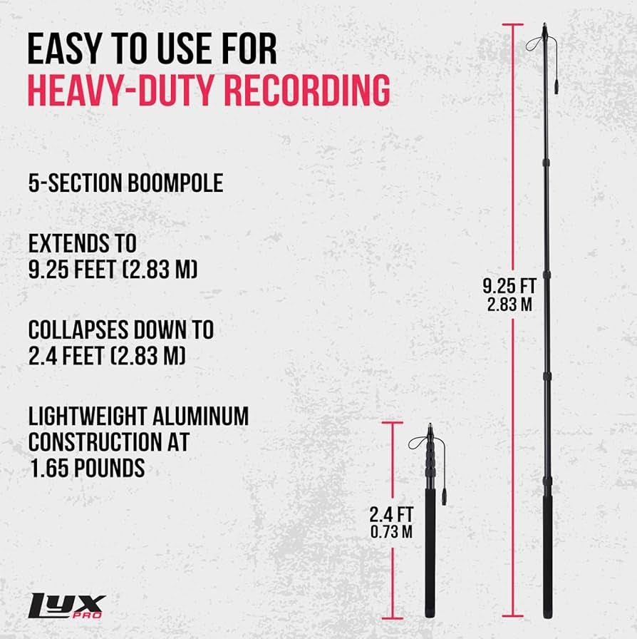
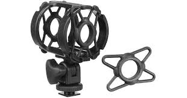
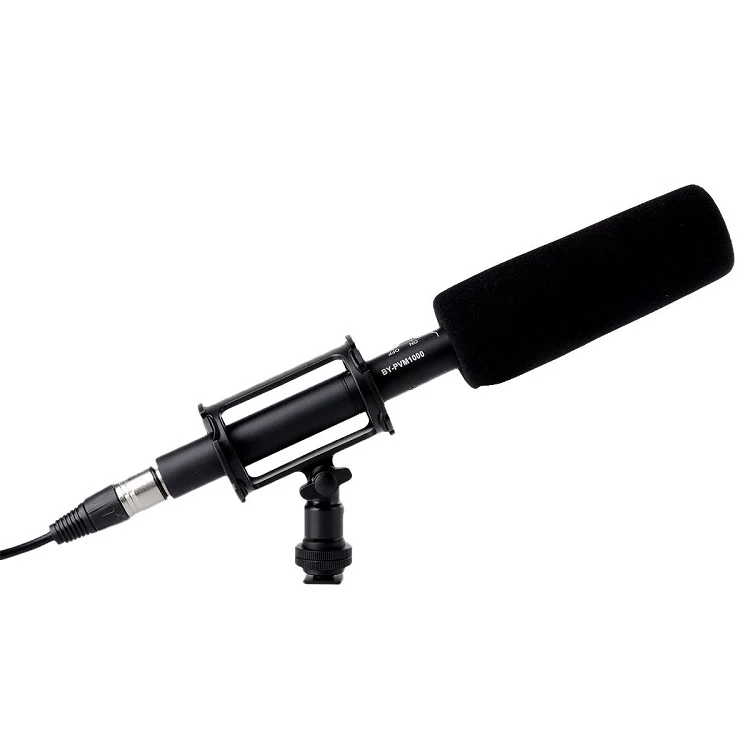
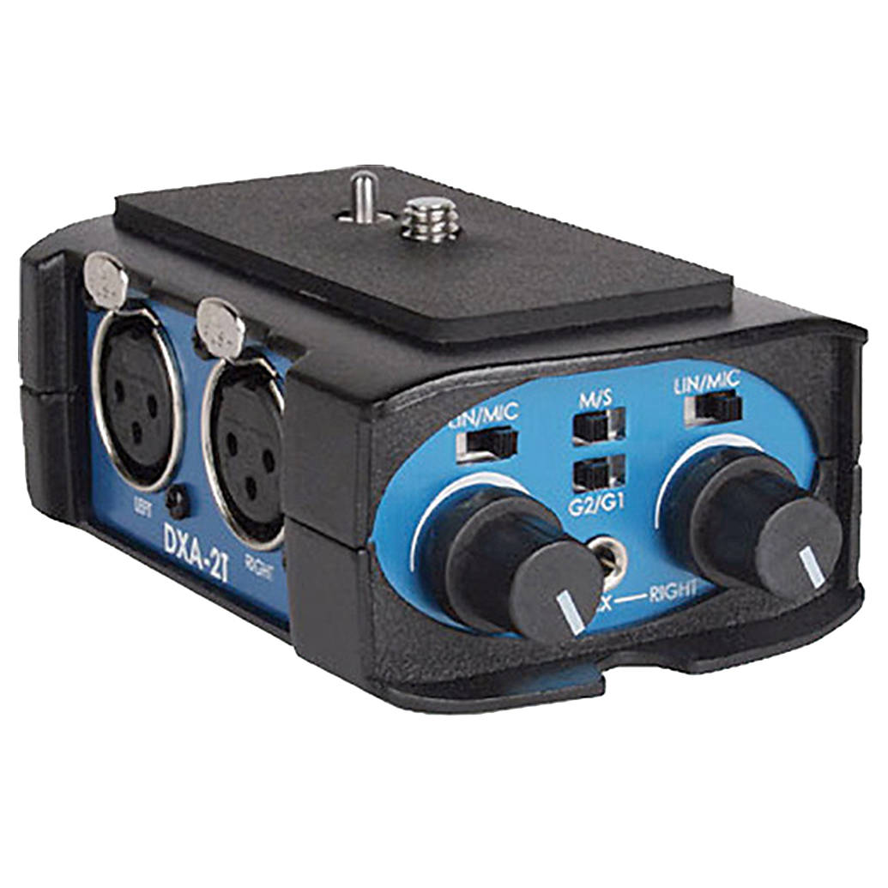
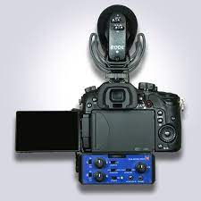
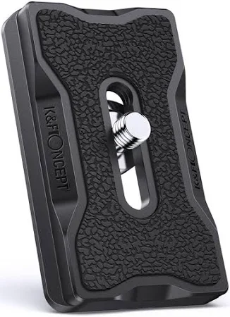
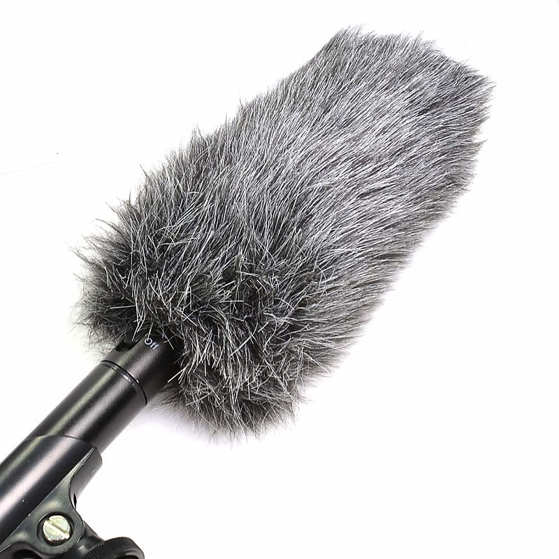

# Shotgun Mic Kit

## What's in the kit?&#x20;

* **Audio Technica AT897 Directional (Shotgun) Microphone for "on-set" sound**
* **LYX PRO Adjustable Boom Pole with built in XLR Cable**
* **A Shock Mount to attach on Boom Pole or Camera "shoe"**&#x20;
* **A DXA-2T Beacktek XLR Adaptor for Camera**
* **Optional "Deadcat," a furry windscreen for windy environments**
* **Foam Windscreen**
* **A 1.5' XLR and 15' XLR to attach to Beachtek or Optional Audio interface.**&#x20;

<figure><figcaption>
the parts assembled (windscreen looks different)
</figcaption></figure>

<mark style="background-color:red;">A note before beginning. You may check out this kit with the</mark> <mark style="background-color:red;"></mark><mark style="background-color:red;">**M4 Audio Interface**</mark> \ <mark style="background-color:red;">**AUDIO KIT**</mark> <mark style="background-color:red;"></mark><mark style="background-color:red;">for truly optimal sound,</mark> <mark style="background-color:red;"></mark>_<mark style="background-color:red;">and</mark>_ <mark style="background-color:red;"></mark><mark style="background-color:red;">to give a sound person the flexibility of not being attached to camera. This means editing sound separately and not having the mic sound directly being recorded into the camera,</mark> <mark style="background-color:red;"></mark>_<mark style="background-color:red;">but</mark>_ <mark style="background-color:red;"></mark><mark style="background-color:red;">will increase the quality.</mark>&#x20;

## The AT897 Shotgun Microphone

<figure><figcaption>
AT897
</figcaption></figure>

The AT897 is a "shotgun" or "highly directional mic" meaning it records primarily what is right at the end of its capsule, making it perfect for on-set recordings, pointed at an actors face for example (out of view of camera of course.) The bottom of it unscrews to contain a 1.5V AA battery but also can use "phantom" power meaning it draws its electricity from the interface it is connected to, or in the case of the Beachtek adaptor, from the camera that is connected to the Beachtek interface.&#x20;

## LXY PRO Adjustable Boom

<figure><figcaption></figcaption></figure>

The LYX PRO Boom is fairly self-explanatory. The grippable and rounded notches unscrew to loosen and extend and tighten to fix in place. <mark style="background-color:red;">Make sure to always properly tighten the notches even when not in use, so that it doesn't extend by accident, causing potential damage to an attached microphone or to a person.</mark> It has a built in XLR cable to connect to the end of the AT897 shotgun microphone.&#x20;

## Shock Mount

<figure><figcaption></figcaption></figure>

A shock mount screws to the top of the Boom Pole or slides into the mic "shoe". ontop of the camera, and has an adjustable nob to change the axis of the microphone.&#x20;

When affixing to the top of the camera, unscrew the bottom wheel at the base of the mount until you can easily slide into the mic shoe. Once in place, screw the bottom wheel until tight.&#x20;

<figure><figcaption>
lumix. hello "shoe"
</figcaption></figure>

In the case of boom pole use, make sure the adjustable nob is firmly set so that the mic does not accidentally tilt down and hit someone or something.&#x20;

<mark style="background-color:red;">To insert the mic in place, slide the mic</mark> <mark style="background-color:red;"></mark><mark style="background-color:red;">**XLR input side first**</mark> <mark style="background-color:red;"></mark><mark style="background-color:red;">into the rubber shock mount</mark>, until the capsule (the part picking up sound with little grooves) is free on the other side. You can then attach the XLR cable once it is a in a good position.&#x20;

<figure><figcaption>
placement of the microphone in shockmount
</figcaption></figure>

\

## BeachTek DXA-2T XLR Adaptor

<figure><figcaption>
Beachtek in Beachy-Blue
</figcaption></figure>

## How Do I Use This?

User Interface: Front

1. **M/S Switch**: The **M (MONO)** setting mixes both channels together and sends the audio to both the right and left channels, which is ideal when only one microphone is being used. The **S (STEREO)** setting keeps both channels separated and should normally be used when two microphones are connected. This provides two discrete channels of audio.
2. **G2/G1 Switch:** Set the G2/G1 ground switch on the DXA-2T to the position that gives you the least amount of noise.
3. **LIN/MIC Switchs:** To connect a microphone to either channel of the DXA- 2T, set the corresponding LIN/MIC switch to MIC.
4. **Left & Right Controllers:** To control the input signal of each mic.
5. **AUX Input Jack**\

User Interface: Side

6\. **XLR Inputs:** Ports to attach 2 XLR cords with mics&#x20;

User Interface: Back

7\. **OUT Jack:** T output the mic level signal from the adapter to the camera. Use the supplied output cable to connect to the MIC input on the camera.

<figure><figcaption>
the Beachtek Attached
</figcaption></figure>

The Beachtek adaptor will attach onto the bottom of your camera. Once positioned onto the "tripod thread" (the hole on bottom of the camera,) use a penny or dime to screw in place from the bottom of the Beachtek. Do so until firmly tightened. The beachtek has its own tripod thread then where you can affix the plate for your tripod if you're using one.&#x20;

<figure><figcaption>
a tripod plate
</figcaption></figure>

## Deadcat

<figure><figcaption>
no cats were harmed in the making...
</figcaption></figure>

Mostly for windy environments, slide the microphone _capsule first_ snuggly into the opening of the regrettably named "Deadcat."The kit also comes with a foam windscreen which can be used to not only limit a casual breeze, but protect the capsule of the microphone.&#x20;

<mark style="background-color:red;">PAGE IN PROGRESS</mark>
