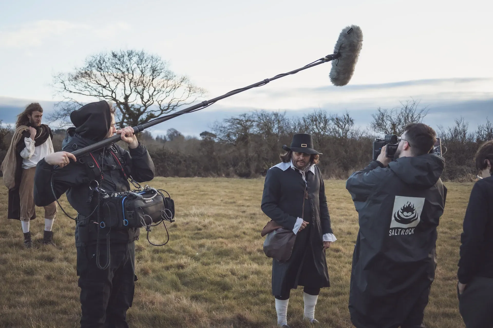
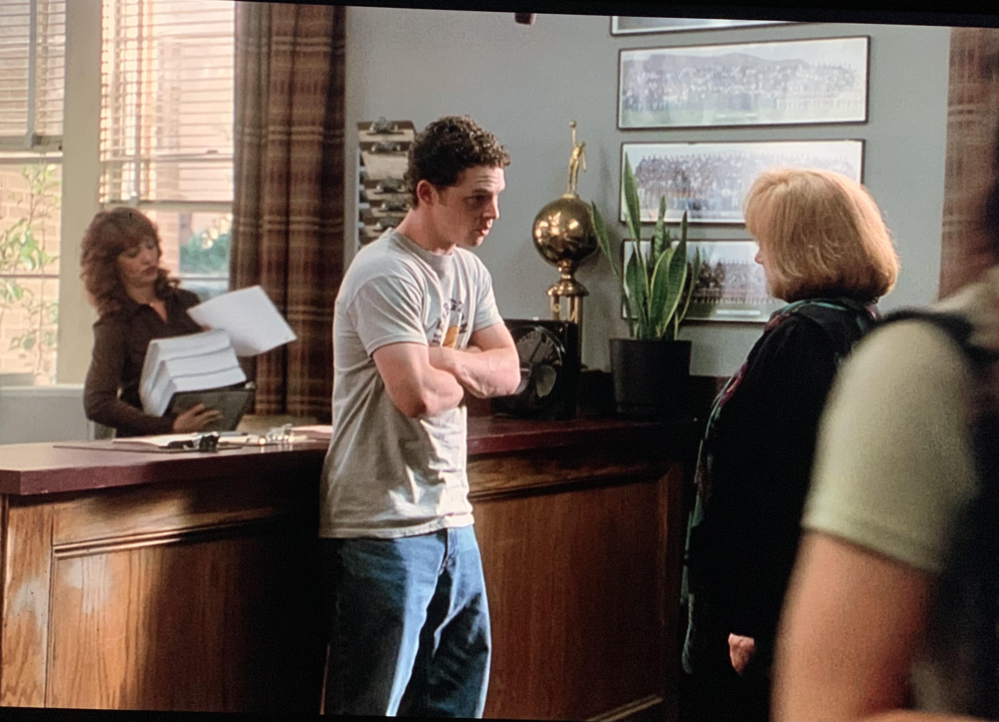
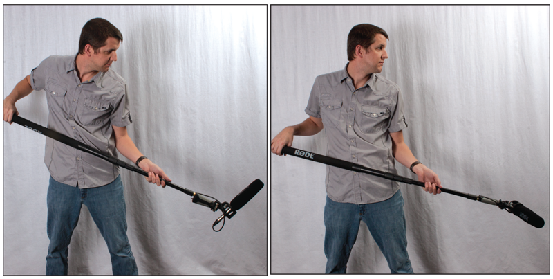
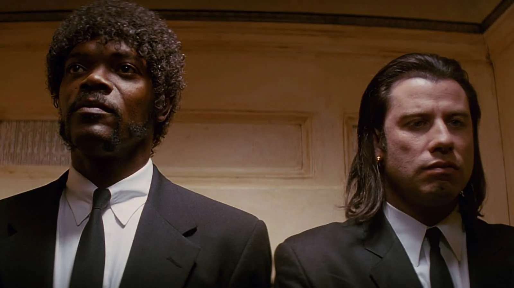

# Booming with a Shotgun Mic

<figure><figcaption>
a boom operator at work
</figcaption></figure>

A boom operator's job is to capture the best sound possible within their available circumstances, largely determined by the placement of the camera.&#x20;

With the exception of when an actor is going to be shouting very loud (something a boom operator may want to know beforehand) the mic should be directed as close as possible towards the actor's mouth (or wherever the intended sound is coming from) without being in frame or risking being in frame with an accidental move of the camera or the boom operator's flagging arm. This should be done in consultation with the camera person before shooting _especially_ when camera moves are involved.&#x20;

<mark style="background-color:red;">Another thing to look out for</mark> <mark style="background-color:red;"></mark><mark style="background-color:red;">**is the shadow**</mark> <mark style="background-color:red;"></mark><mark style="background-color:red;">created by the boom pole, especially using artificial lights.</mark>&#x20;

<figure><figcaption>
BOOM IN!!!!
</figcaption></figure>

<figure><figcaption>
two options
</figcaption></figure>

The first image at the top of this article is a good example of a boom use that would get tiring with extended use. These two examples show more relaxed use, though it would depend on the placement of the actor, the frame whether you could employ it.&#x20;

<figure><figcaption>
from below
</figcaption></figure>

In some cases, there is no head-room for the boom, so booming from below is an option.&#x20;

## What if I only have one mic?&#x20;

The boom is the most versatile instrument if you only have one mic because the boom operator can manually change the position during a scene. Also, along with maneuverability, it is a direct input of the sound compared to a lavalier or "lav mic" which can be impeded by the brush of an arm or by the movement of the clothes it is affixed under. Ideally, if you have a scene with two actors and you are looking to capture the sound from both actors during a take, you would have both actors with lavalier microphones (see field recorder page) and the additional boom would capture sound as well. Which mic captures the best sound would depend on a few factors.&#x20;

It is up to the discretion of the sound person whether they are going to shift the mic from one person to another in a scene to try to capture both people in the scene's audio at an optimal level. If the camera is capturing primarily one actor's perspective, such as an "over the shoulder shot" (seen below) meaning only one actor's lips are visible, then you may want to prioritize pointing the shotgun at that actor.&#x20;

<figure><figcaption>
I want someone to look at me like that
</figcaption></figure>

If the shot has two actors speaking simultaneously however...

<figure><figcaption>
current mood
</figcaption></figure>

...then the mic may be placed in between the actors and be tilted live to try to capture whomever is speaking, alternating back and forth.&#x20;

Another job the sound person has is setting the "Gain" or the input level of the sound coming from the microphone. A too high gain set will risk having the sound distort  if the actor shouts all of a sudden for example,) but too _low_ will mean the audio will have to be enhanced in post editing and could lose the quality and clarity. The gain levels are set on the input nobs on the Beachtek as well as the in-camera settings.&#x20;

&#x20;<mark style="background-color:red;">**If you are using the M4 Interface**</mark><mark style="background-color:red;">, you have the luxury of not having to monitor gain as it uses 32 Bit Float Audio that can be adjusted in post to achieve the optimal sound. You still want to place the microphone at an optimal position, however.</mark>&#x20;

\ <mark style="background-color:red;">PAGE IN PROCESS</mark>

