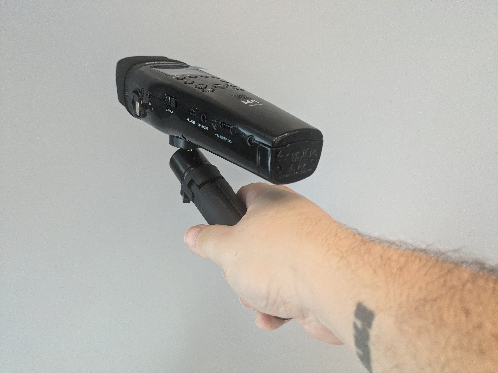

# Zoom M4 Audio Recorder

## Overview

The Zoom M4 has two onboard mics for high quality stereo sound. In addition those, the M4 also has two XLR/1/4" jack inputs that can be used with a variety of other external microphones or instruments. The M4 records in 32 bit float format which avoids clipping meaning there is no need to set gain. This versatile piece of equipment normally acts as an audio recorder, but it can also be used as an audio interface, allowing you to record directly onto your computer using whatever software you like, such as Ableton Live, Adobe Audtion, Reaper, Etc.&#x20;

<mark style="color:orange;">Note: If using as an audio interface the onboard mics are routed as input 1+2. The external inputs on the M4 are routed as 3 or 4.</mark>&#x20;

## Kit Layout and CheckList

<figure><figcaption></figcaption></figure>

## Setting up Tabletop Tripod

1. Remove the tabletop tripod and ball head from the kit (located under the M4 recorder)
2. Screw the ball head onto the top of the tripod,&#x20;
3. Screw the tripod with ball head into the underside of the M4 recorder
4. Splay out the tripod feet and place it facing the onboard mics toward the subject of the recording
5. The side screw on the ball head can be loosened and tightened to for more specific positioning of  the M4 recorder.

<figure><figcaption></figcaption></figure>

 

<figure><figcaption></figcaption></figure>

 

<figure><figcaption></figcaption></figure>

The Tabletop Tripod can also be used as a versatile pistol grip for field recordings

<figure><figcaption></figcaption></figure>

## Zoom M4 Diagram + LayOut

<figure><figcaption></figcaption></figure>

<figure><figcaption></figcaption></figure>

## ADDING / REMOVING BATTERIES

The Zoom M4 utilizes 4 AA batteries to operate. It can also operate using the USB-C cord while connected to a computer. The kit included 4 Rechargable AA batteries as well a charger.&#x20;

To add to remove the batteries:

1. unlock the battery door at the bottom the recorder by rotating the lock screw counter clockwise. If it is difficult to do this with your fingers, you can use a coin or flat head screw driver. <mark style="color:orange;">Note: The screw will never actually fall out. Simply unscrew until the battery door becomes loose</mark>
2. Pull the battery door out, revealing the carriage where the batteries can removed or added.&#x20;
3. Add fully charged batteries to the carriage, then insert the carriage into the M4 and turn the lock screw clockwise until the carriage is again secure.

<figure><figcaption></figcaption></figure>

 

<figure><figcaption></figcaption></figure>

