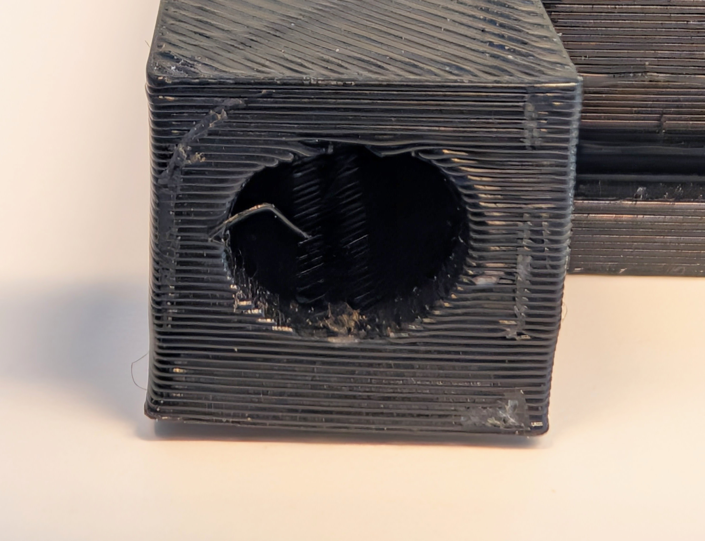

# 🕳️ 3D Printed MM Hole Guide with Pegs

getting tolerances for things like holes and pegs can be tricky with 3D printing, as tolerances can change based on printer, filament type, size of your components, evironmental factors, even filament color and brand can affect how accurate your holes and pegs are. What may have printed out well on one printer may not print out the same in another. The Millimeter Hole guide with Pegs, is a tool that you can use to make sure you are designing holes and connector pegs with the correct tolerances.&#x20;

## Reading the guide

The guide should always be read from left to right, with the giant thumb hole oriented on the bottom left corner. To read the size of each hole directly, take the number on the left of that row and add to the number at the top of the column. The hole sizes get larger from left to right, ending at the "\_.9" size for that hole size, which is indicated on left most column. For example in the image below, the hole in green is a design size 7.3mm because its in row 7 and in column .3. Notice that I said _**design size**_. What is design size? read the next section to find out.&#x20;

<figure><figcaption></figcaption></figure>

## Design Size vs True Size

Design size refers to the size a particular compontent has been designed to be in software. However, all fabrication is imperfect. Even when you cut a piece of wood with a table saw, its understood that even the best cuts may be a 1/16" off. 3D printing is no different. FDM based 3D printing (printing that uses filaments as opposed to something like resin) works by using thermoplastics, which melt at high temperatures, and then are rapidly cooled to form the designed shape, meaning that the material is expanding and contracting, which leads to shrinkage. There are also instances where too much filament is pushed out of the nozzle which blobs/bleeds outside of the intended design size, leading to larger or smaller parts depending on the orientation.&#x20;

The same is true of the pegs included with the hole guide. These pegs were designed using the sizes indicated on the peg  (2mm - 12 mm), however, their true size may be slightly larger or smaller due to  either shrinkage or expansion.

<figure><figcaption>
attached to the hole guides are pegs varying in incremental size from 2mm-12mm
</figcaption></figure>

### Why does this matter

It matters because what you read or see in your design file or in this hole guide may not be accurate. That 7.3mm hole was designed to be a 7.3mm hole in software, but may have actually been printed as 7.2 or 7.25 mm hole due to shrinkage. While this might be consistent enough if both your hole and your peg are 3D printed (using the same filament, on the same printer) that it may not mater, what if you are introducing a steel bolt into you design, or if your 3D print has to mount into a pre-existing hole on a different real world object? Those tolerances are likely to be different than ones for 3D printing.&#x20;

#### Example

For example, imagine you order round magnets on amazon that the manufacturer claims are 8mm in diameter. If you take them at your word, you might think, ok, I will design my hole to be 8.1mm. However, when you print your part, the magnets don't fit, because the magnets are actually 8.3mm,  which you find out after measuring them yourself. So you redesign your hole to be 8.4mm hole, and print it out again only to find it again doesn't fit because your 8.4mm designed hole was actually printed as a 8.2mm hole due to shrinkage. Instead of going through all that trial and error, you could use the hole guide to try the magnet in each hole until it fits, in this case at 8.6mm, and be fairly confident that it will print correctly the first time. Even if the physical hole itself may be smaller than 8.6mm,  it wont matter because its clearly larger than the 8.3mm magnet you just tested. While we can't avoid that that there will be differences between design size and true size, [there are things we can do to minimize these differences for more dependable prints which we will talk about in a section below ](3d-printed-mm-hole-guide-with-pegs.md#things-you-can-do-to-get-more-consistent-results-for-holes-and-pegs)

<figure><figcaption>
using the guide to determine the best hole design size for printing designs that will interact with these particular real world objects. 
</figcaption></figure>

## Using the pegs and real world objects

Most often you will design your pegs first and your hole second. The pegs vary in whole integers from 2mm to 12mm. You can use the printed pegs to then determine what your corresponding hole size should be in your designs. You can design pegs that are in between, like a 5.6mm print, and then use the guide, but in general its easiest to stick to whole numbers when designing for this reason. Similarly the pegs can be used to determine the best design size for fitting into an existing hole on a real world object.&#x20;

<figure><figcaption>
a 6mm peg being a good fit for the hole in this spatula handle 
</figcaption></figure>

## Things you can do to get more consistent results for holes and pegs

* Use the same printer, filament (at least type, even better if same manufacturer and color), and print settings whenever possible, varying the printer and print settings may still produce reliable results but reducing the amount of change and variables is best when possible
* If using a slicer like [Prusa Slicer, select the advanced option of printing outer walls before inner walls](https://help.prusa3d.com/article/layers-and-perimeters_1748#external-perimeters-first). This helps reduce the possibility bulging or expansion of the filament outside of your design size, allowing you to only have to worry about shrinkage.&#x20;
  *

      
<figure><figcaption>
Screen shot of where to toggle the "external perimeter first" parameter in Prusa Slicer
</figcaption></figure>

* Test your connections before you print out your whole design. Try printing out just the portion of your design that has the hole, peg or both that you are interested in testing so as to not waste time and material.&#x20;
* If possible, when designing, avoid placing pegs and holes sideways. If you must, know you will likely need to increase your tolerances due to warping.&#x20;
  * <mark style="color:orange;">Note: The guide and pegs assume that the holes and pegs that are being printed are facing up and perpindicular to the build plate, which provides the greatest dimensional accuracy. Holes or pegs that are facing sideways or parallel to the build plate will require supports, which while helpful, add another variable to dimensional accuracy and can sometimes produce inaccurate results. For example, below you will find a hole whose design size is a 6.4mm circle. However, due to the weight of the above layers, its deformed into an oval, measuring 6.4mm wide by 6mm tall.</mark> &#x20;
  *

      
<figure><figcaption></figcaption></figure> <figure><figcaption></figcaption></figure> <figure><figcaption></figcaption></figure>

* <mark style="color:orange;">Note: that the hole guide provided is technically only accurate for the filament it was printed on and the printer it was printed on, which is the Prusa Mk4S in the PML and Elegoo Gray PLA. While it is still relatively reliable to use with other PLA and Printers, there may be a slight margin of error.</mark>&#x20;

