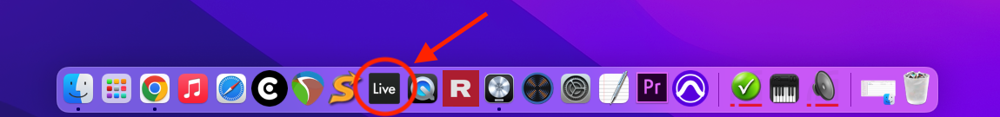
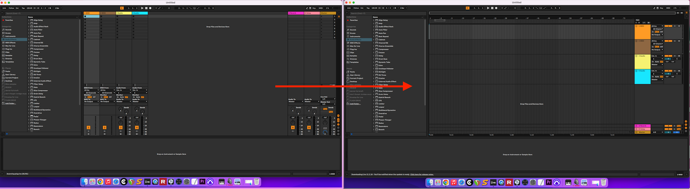
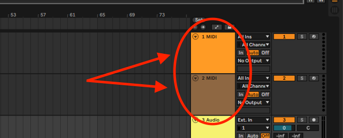
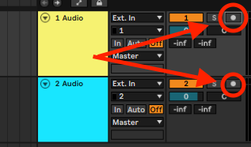
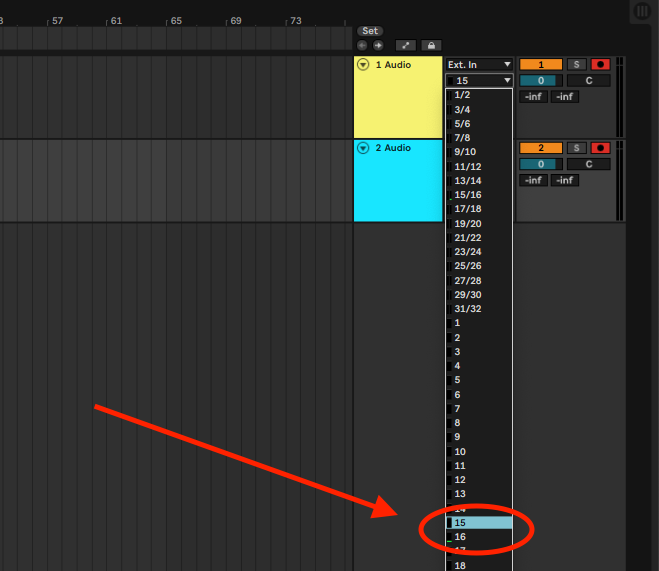
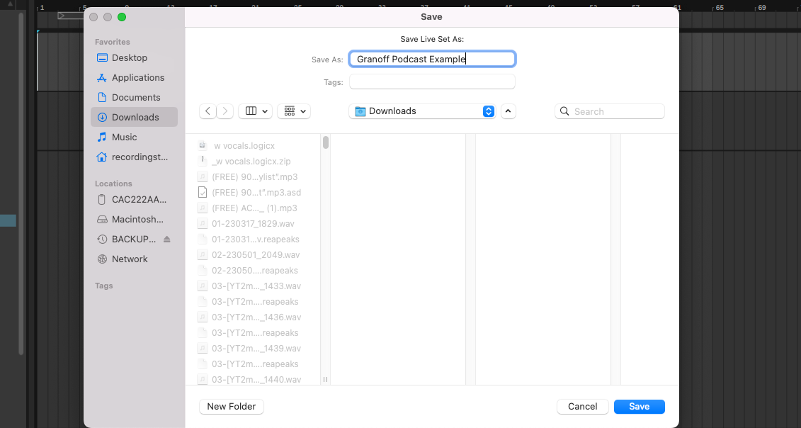
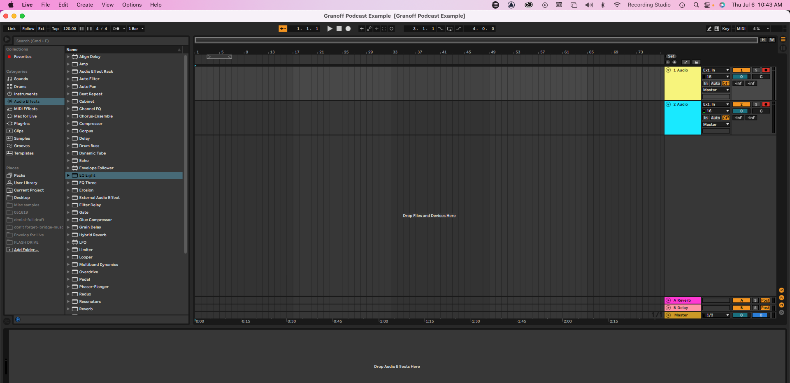

# 🖥️ STEP 1: Setting up Ableton for Recording

1. Launch Ableton Live

<figure><figcaption></figcaption></figure>

2. Press 'tab' to switch from 'Session' to 'Arrangement' View

<figure><figcaption></figcaption></figure>

3. Select and Delete two 'MIDI' Tracks (click on each box and press 'delete')

<figure><figcaption></figcaption></figure>

3. Arm both audio tracks for recording by pressing on circular button on Top Right of the Mixer

<figure><figcaption></figcaption></figure>

4. Click on the '1' and '2' drop down menus underneath 'Ext. In' and Select 15 and 16 as respective inputs

<figure><figcaption></figcaption></figure>

<figure><figcaption></figcaption></figure>

5. Press 'Command+S' to save this set up. I recommend creating a New Folder in 'downloads' for all your files.

<figure><figcaption></figcaption></figure>

6. Your Ableton Live Session should now look like this:

<figure><figcaption></figcaption></figure>

Now we're ready to set up Microphones!
