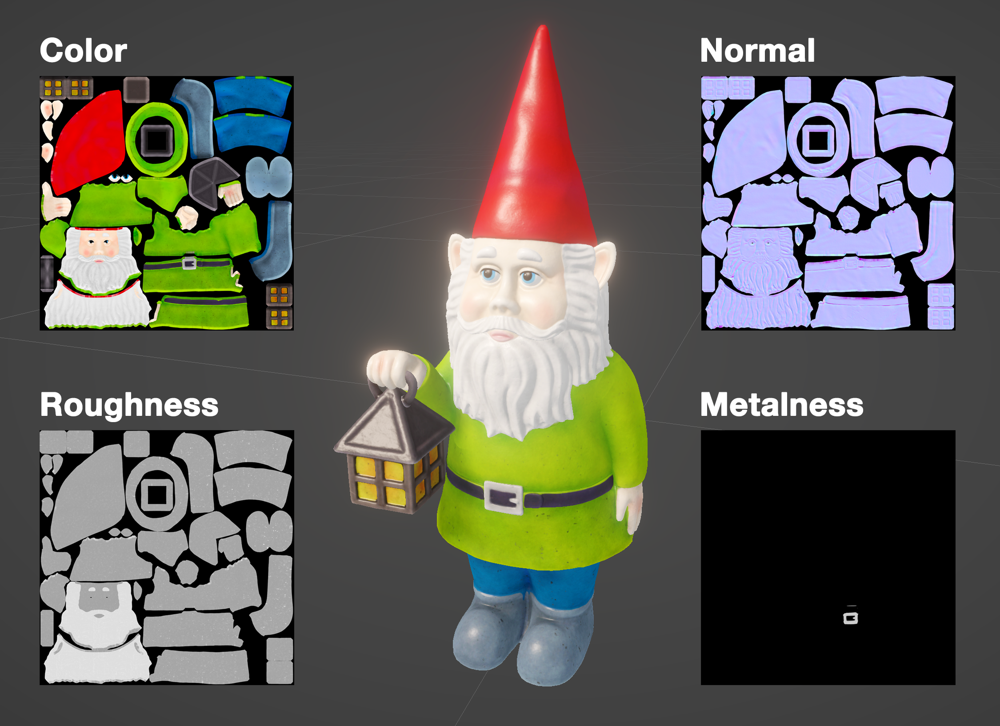

# Building 3D objects

Creating the simulation of a 3D world that makes up most video games is a lot of work, even for a gnome. Developers build these simulation from a set of building blocks that handle different aspects of the simulation and tend to only use the piece they need for a given scenario to save on memory and calculations.

They also might use short cuts that may not represent the world exactly but make it faster. Here are some of the build blocks of a 3D object in a game engine.

## Mesh

<figure><figcaption>
A wireframe rendering of a 3D object in Unity 3D. Meshes are made up of vertices from which triangular faces are formed.
</figcaption></figure>

### Vertices, faces and poligons

3D models used for games, animation and 3D renderings are built from points or **vertices** that represent the surface of the object. These vertices are connected to neighbor vertices in to **triangular faces** which infinitesimally thin. These triangle might be combined into larger **quads**(quadrilateral) or **poligons** and are used to represent the visual appearance of objects in a scene.

The complexity of a 3D scene is often judge by its **poligon count** which is just the total sum of all the triangles in all of the objects in a game scene. Keeping this count low is import to game performance so a model like this gnome might be simplified significantly before being used in a game.

## Lighting and surfaces

<figure><figcaption>
A surface rendering of a mesh. The triangular faces are used to calculate a continuous surface.
</figcaption></figure>

The faces of the mesh, combined with the position and direction of lights and the camera now make it possible to calculate the lighting and shading of the object. Most 3D meshes are **smoothed** when lighting so that the individual faces are blended together. Without this smoothing the mesh will look blocky.

As you can see there is no color. That comes next.

## Textures and material

To give the object color you need to add a **material**. A 3D objects material holds information not just about its color but the smoothness, transparency, how light travels through it and whether it looks like plastic or metal. Most objects might have both different colors and material qualities for different parts, for instance our gnome has a red hat and a white beard and his belt buckle is shiny and metalic where as his tunic is more rough.

<figure><figcaption>
The gnome has four texture maps in its material, color, roughness, normal and metalness. Only the belt buckle has any metalness.
</figcaption></figure>

In order have different colors or quality on the same object you might assign materials to different parts. More commonly you would have a series of **texture maps** that map all of the faces of object to a location on a 2D image file. The result is something like a crazy fabric pattern with the gnomes body flattened and cut up into pieces.&#x20;

Each texture map has a different function: **color, roughness, metallic quality**. There are also texture maps to add detail that the meshes triangles don't capture. **Bump and normal maps** allow the lighting to fake small shadows of the object while the meshes surface is still basically flat.

## Collider

So far our object has a realistic visual appearance but has no way to interact with the simulated world around it. 3D models are essentially paper thin ghost with no physical structure. You may have noticed this when you accidentally walked through a wall in a video game.

<figure><figcaption>
The gnome uses three simple colliders, two boxes and a capsule, to approximate the form of the more complex mesh.
</figcaption></figure>

For the simulation to calculate when an object has touched another object you need a collider. **Colliders** are additional 3D shapes you add to your model that the system then uses to calculate the distance between objects. While these 3D shapes can be meshes just like the one used for the gnome they are often much simpler: a sphere, cube or capsule. These simple shapes make it very easy calculate distance. For a sphere knowing its center and radius let you know if a point is inside or outside the shape.

<figure><figcaption>
Without a collider objects won't interact with each other.
</figcaption></figure>

Our gnome has three colliders a capsule for the body, a cube for the feet and another cube for the latern. Even 3 separate simple colliders is more efficient than using the mesh itself as a collider. In most cases you won't know the different when the object is used in a simulation.

Colliders can be used to simply know when something is near an object or area. You could use a collider to trigger when a player has entered the endzone of a football field.

## Rigidbody

The last piece of the puzzle is some basic physics. Objects so far can be seen and even collide with other objects but there is no physics. The object will not fall. It doesn't have a mass. If something bumps into it it won't move and it doesn't have other characteristics like bounciness.

<figure><figcaption>
Without a rigidbody objects won't calculate physics which means they won't be effected by gravity.
</figcaption></figure>

**Rigidbodies** give an object these additional quality, and are the heart of the physics simulation. In addition to the rigidbody itself game engines like unity provide the ability to add **physics materials** which let you simulate aspects like bounciness.

To create more complex objects you can add joints between rigidbodies, although for many cases this isn't necessary. Other physics can be simulated with soft body simulations like cloth or ragdolls for moving characters and other flexible objects in a realistic fashion.

## Further extending game objects

The object components above form the basis of creating 3D objects you can interact with. Not every object needs all of these components. In addition many more components can be added to game objects that extend their functionality: **scripts, animations and sounds** are often added to help with a games logic.

