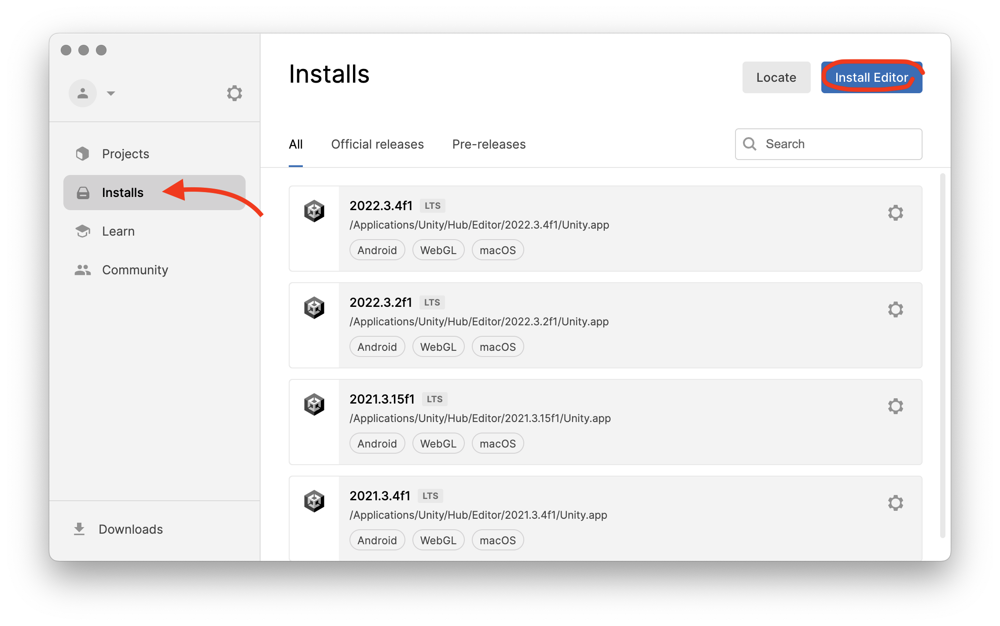
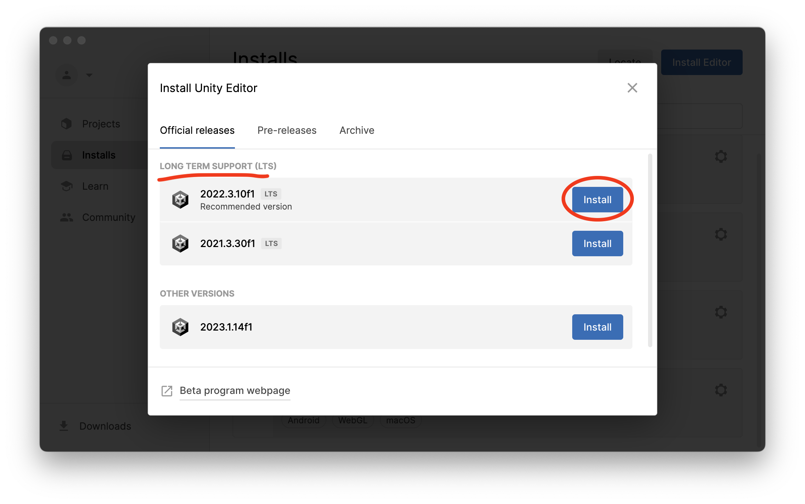

# Setting up Unity

## Download Unity Hub

<figure><figcaption></figcaption></figure>

**Unity Hub** is a program that helps manage your licenses, projects and unity installations.

Go to [https://unity.com/download](https://unity.com/download) to download Unity Hub for your operating system.

## Install Unity

Once you have installed Unity Hub you will need to install a version of Unity. In Unity editor click on Installs on the right side of the window and then click the Install Editor button in the upper right corner.

<figure><figcaption></figcaption></figure>

Unity Projects are tightly connected to the version of Unity you create them with so it is best to using a LTS (**Long Term Service**) version of the application which is supported longer. You can install multiple versions of Unity at once for different projects.

<figure><figcaption></figcaption></figure>

Up next


[building-3d-objects.md](building-3d-objects.md)

