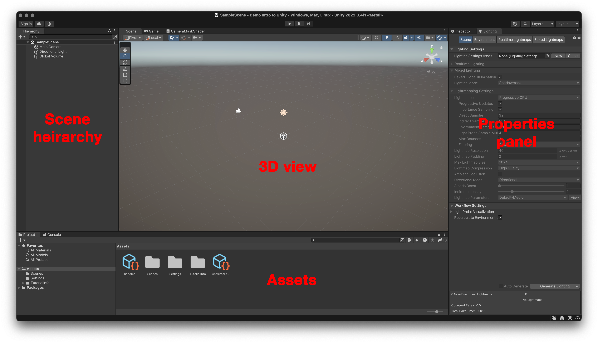

# Using Unity

This page goes over the basics of the Unity interface and the parts of a Unity workshops. For a more detailed tutorial on using Unity use the resources at [https://learn.unity.com](https://learn.unity.com) which has extensive documentation and tutorials available.

## Scene

Every Unity project has at least one **scene**. A scene contains all the elements a player/user would interact with at a time. You might create different scenes for different levels of your game or for menus or start views for your application.

The default scene starts out with some basic items: a cube, a camera and a light.&#x20;

## Interface overview

<figure><figcaption></figcaption></figure>

There are four main areas of the Unity Interface.

### 3D view

<figure><figcaption><p>A 3D model of a gnome inside Unity's 3D view.</p></figcaption></figure>

This window at the center of the interface show you a 3D view of your scene. This isn't necessarily the view a player would see when playing but can be adjusted to any angle that is convenient to manipulate the elements of your scene in 3D space.

When you run your Unity project players see a view from the perspective of the camera included in your scene.

### Scene hierarchy

<figure><figcaption><p>Unity scene hierarchy panel with an example scene.</p></figcaption></figure>

This is a text list version of what can be found in the 3D view. This hierarchy shows only items that our actually in your scene and how they relate to each other. This is a good place to look if you want to select a specific item in your scene.

### Properties panel

<figure><figcaption></figcaption></figure>

This panel on the right, lets you manipulate properties of items in your scene. This can be there position, color etc. as well as what scripts are attached to them or other modifiers.

### Assets

<figure><figcaption><p>The asset panel for an example project.</p></figcaption></figure>

The assets panel is where you might store various items your project might need. This could be 3D models, images, sounds files or scripts. These items are NOT in your scene yet just part of your project.

## Game objects and prefabs

### Game objects

The most basic element of a Unity scene is the game object. Game objects can include:

* 3D models
* Images
* Lights
* Cameras
* Objects to hold scripts
* Objects to hold sounds
* Triggers and colliders for reacting to events

### Prefabs

Prefabs are special template game objects you can use to make your game more efficient and easier to manage. These objects are basically clones of a single game object that can be reused. Any object that doesn't need to change but you need to make multiple copies of is a good candidate for a prefab.

When you modify a prefab all instances of it also change.

## Assets

The assets area includes any of the raw elements of your project. This can include, Prefabs, 3D models, scripts, textures, images, sounds or other media. Items in your assets are like a library from which you can work from. They aren't part of your scene until you add them to the hierarchy. Unity automatically organizes where these asset files live in your project folder, and will recognized updates to the files from outside of Unity.

## Scripting

Unity uses **C#** as its primary scripting language. Scripts can be attached to any game object to add additional functionality. Most scripts will be derivatives of the **MonoBehavior** class. This class lets you hook into Unity's event loop which controls when various parts of a game are updated and rendered to the screen.

The script below extends the MonoBehaviour class to add features for a Bowling ball object.

It implements two different methods Start and Update which are triggered at different parts of the event loop.

```csharp
using UnityEngine;

public class BowlingBallController : MonoBehaviour
{
    public float thrust = 2000f;
    public float speed = 2.5f;
    Rigidbody rb;
    bool thrown = false;

    // Start is called before the first frame update
    void Start()
    {
        //Get the Rigidbody component of the game object
        //this script is attached to.
        rb = GetComponent<Rigidbody>();
    }

    // Update is called once per frame
    void Update()
    {
        //Check if the bowling ball object has been thrown
        if( thrown ) {
            //Check if the ball has fallen below -5 (meters) 
            //if it has destroy this object
            if(transform.position.y < -5f) {
                Debug.Log("Destroy bowling ball.");
                Destroy(gameObject);
            }
        } else {
            //If the ball hasn't been thrown wave it back and forth
            //across the aisle
            float xPos = Mathf.Sin(speed * Time.time) * 0.5f;
            transform.position = new Vector3(xPos, transform.position.y, transform.position.z);

            if(Input.GetButtonDown("Jump")) {
                Debug.Log("Throw!");
                rb.isKinematic = false;
                rb.AddForce(transform.forward * thrust);
                thrown = true;
            }
        }
    }
}
```


## What's next?

One of the best ways to learn Unity is to use their own tutorials and resources:



To learn how to set up a **Virtual Reality project** in Unity 3D you can follow our walkthrough:


[virtual-reality-with-unity-getting-started](../virtual-reality-with-unity-getting-started/)

