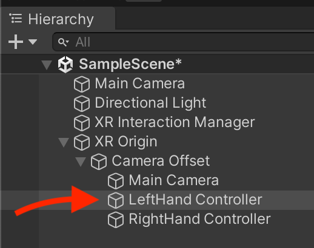
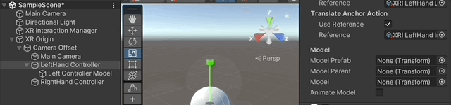

# Setting up your project

These instructions were written for **Unity version 2022.3.4f1.** They may not work for future versions.

## Create new project

In Unity Hub create a new project with the **3D (URP)** template. Give it a name and choose its locations.

<figure><figcaption></figcaption></figure>

## Install packages

1. Go to the menu item **Window > Package Manager**&#x20;
2. Switch Packages from _In Project_ to **Unity Registry**\
   .png>)
3. Under _Features_ install:
   * **VR** (2 packages)
4. After installing you will be prompted with a warning: "Do you want to enable the backends?" Click **"Yes"**
5. Under _Packages_ install:
   * **XR Interaction Toolkit**&#x20;
   * **XR Plugin Management** (This should already be installed with VR Features)
6. A second dialog titled "_XR InteractionLayerMask Update Required_" will pop up. Click **"I Made a Backup, Go Ahead!"**
7. Before closing the _Package Manager_ window, go to the _XR Interaction Toolkit_ package and click on the _Samples_ tab. Import **Starter Assets.**

## Edit project settings

1. Go to the menu item _Edit > Project Settings_
2. Under **XR Plug-in Management,** click the _Android_ tab. Check the box for **OpenXR**
3. Under **XR Plug-in Management > OpenXR**
   * Click the "+" under _Interaction Profiles_ to add a new profile for your device:
     * Quest 2 > Oculus Touch Controller Profile
     * Quest Pro > Meta Quest Touch Pro Controller Profile
   * Under OpenXR Feature Groups, check the box for **Meta Quest Support**
4. Go to **Player**:. Change **Company** and **Product Name**. Avoid spaces and symbols.

## Edit build settings

These instructions are for Mac development.

1. Go to _File > Build Settings_. Under _Platform_ choose **Android**.
2. Click the button **"Switch Platform"**
3. Connect your device to your computer via USB
4. Under _Run Device_ click _"Refresh"_ then choose your device from the List. You may need to click allow from within the device.
5. Click **Add Open Scenes** to include the SampleScene in the build.

## Setting up the scene

### Creating the XR Origin

1. Add an XR Origin by going to the Hierarchy add **XR > XR Origin**. \
   <mark style="color:red;">**NOTE:**</mark> <mark style="color:red;"></mark><mark style="color:red;">Do</mark> <mark style="color:red;"></mark><mark style="color:red;">**NOT**</mark> <mark style="color:red;"></mark><mark style="color:red;">select the XR > Device-based > XR Origin</mark>\
   
2. The select the left hand controller objects inside the Camera Offset inside the XR Origin.\
   
3. On the _XR Controller (Action-based)_ component of the LeftHandController click the preset menu and choose: **XRI Default Left Controller**.\
   .png>)
4. Repeat the above for the _RightHandController_ choosing the _XRI Default Right Controller_ preset_._

### Adding controller models

You can add models for physical controller to help show where they are in space by adding a mesh object or prefab object.

Unity provides generic controller objects for the left and right hand _XR Interaction Toolkit > \[VERSION] > Starter Assets > Prefabs > XR Origin Pieces > XR Controller Left_ (and Right). Meta provides [3D models](https://developer.oculus.com/downloads/package/oculus-controller-art/?locale=en\_GB) of their physical controllers.

1. Add your model or prefab as a child of your _LeftHandController_ object. Make sure the nested models Transform position is set to (x: 0, y: 0, z: 0). If you add the object directly from the your _Project Assets_ it should be positioned correctly.
2.  After nesting your model in the _LeftHandController_ object, select the _LeftHandController_ and in the inspector find the section labeled _Model_ in the _XR Controller_ component. Click and drag the controller model from the heirarchy into the drop down box labeled **Model Prefab**.\

    <figure><figcaption></figcaption></figure>
3. Repeat steps for the _RightHandController_.

