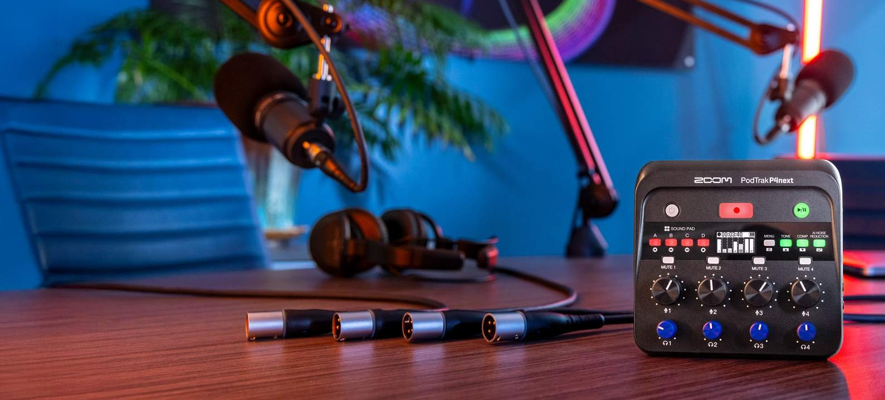

# Podcasting in the Capture Studio @ CATS

_<mark style="background-color:$warning;">**Podcasting in the Captures studio does require that you are both a**</mark>_ [_<mark style="background-color:$warning;">**CATS member**</mark>_](https://brown.edu/go/cats_orientation)_<mark style="background-color:$warning;">**, and have successfully completed the**</mark>_ [_<mark style="background-color:$warning;">**Capture Studio training**</mark>_](https://brown.edu/go/cats-capturestudio)_<mark style="background-color:$warning;">**, both of which can be done online.**</mark>_&#x20;

<mark style="background-color:orange;">Note: This resource is designed for beginers who are looking for an easy setup to start their podcasting journey. Advanced users already familiar with using audio interfaces should may use our setup for advanced workflows on their own, understanding that they must return the device back to our base settings when finished, which can be found throughout this resource.</mark>&#x20;

About the Audio Recording Device: The Podtrak P4Next

<figure><figcaption></figcaption></figure>

Our podcasting setup in the capture studio revolves around the Zoom Podtrack P4Next audio recorder. With our setup you can:

* have up to 4 mics, with each person having their own set of headphones (provided)
* record both in stereo (all four mics mixed down automatically into the standard 2 channel formatted file) for easy and less technical situations, as well as record each indinvidiual mic into its own separate file for more professional mixing in post-production
* AI based Noise Reduction can be used to eliminate room sound and background noise to deliver cleaner audio
* Easy on-device recording, no need to for a laptop except to transfer your files. Advanced users can also use this as an audio interface for direct recording into a DAW or to use our mics with applications like zoom, OBS, etc.&#x20;

This video gives you an overview of the Podtrak P4Next:

[https://youtu.be/OLa\_AJLdSxw](https://youtu.be/OLa_AJLdSxw)

## The Podcasting Crate

Because the Capture Studio was originally designed for self-service easy video recording, it can't accommodate a permanent podcast recording setup, meaning it has to be setup and broken down for each session. Fortunately, we have made this as easy as possible by designing the CATS podcasting crate!

## CATS Podcasting Crate Policies

These policies are mentioned again throughout this guide, but are organized here in no particular order for convenience:

* **It stays in the studio:** None of the podcasting equipment should ever leave the Capture Studio, for any reason. The crate and all its contents stay in the Capture Studio&#x20;
* **Do not remove the SD Card**: There is no need to remove it. All file transfers should happen via the provided USB-C cable to your laptop or other such device. The SD card is small and when removed, often gets lost, which disrupts the service
* **Return device to base settings**: More advanced users may want to change some of the settings on the P4 Next. If you do, you are expected to return all those settings back to our base configuration at the end of your sessions. This ensures that more novice users will be able to use our setup as designed.&#x20;
* **Report Damage or Loss**: We need to know if something is non-operational so that we can address it. Email CATS@brown.edu, with a detailed description of the issue. We will not assume you caused the damage, but please be honest if you did so that we can better train you and avoid further damage in the future.&#x20;
* **Learn the Studio Policies**: These policies are in conjunction with the more general and overarching Capture Studio policies, which you should have learned about in your online training.&#x20;

