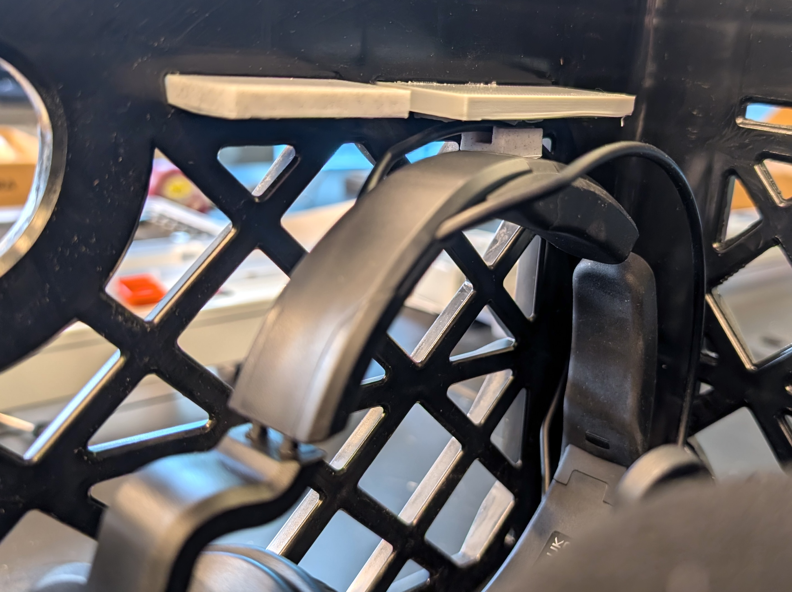
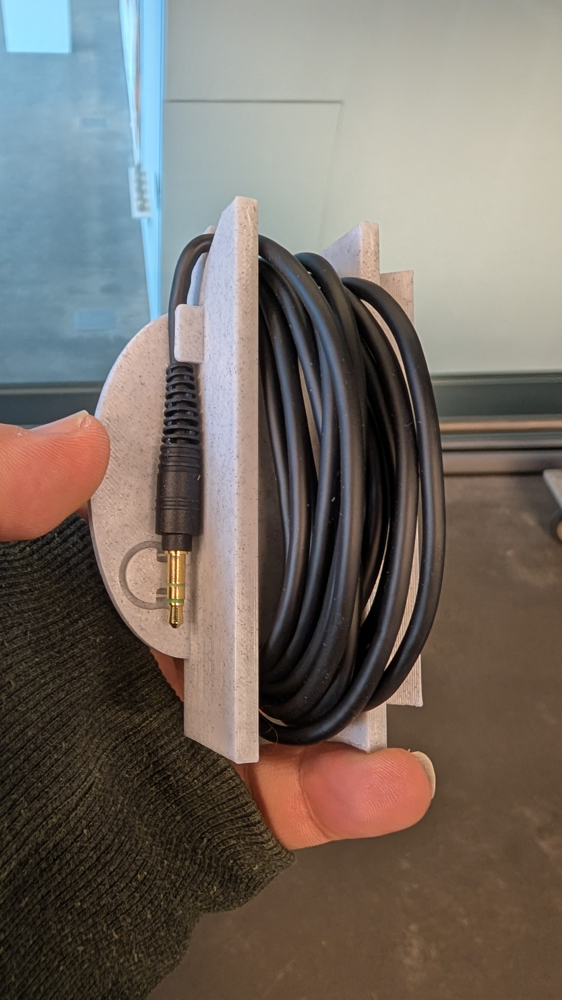
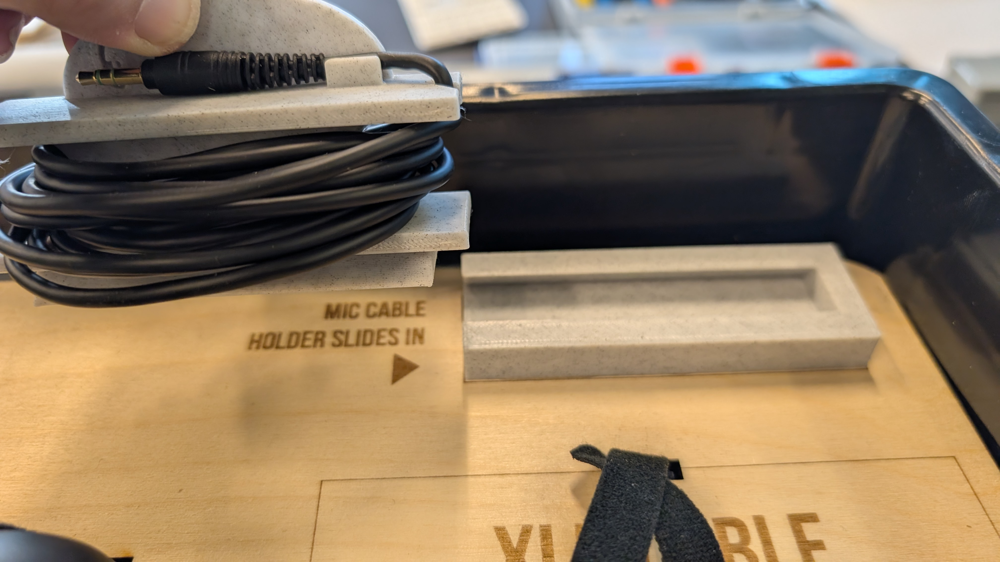
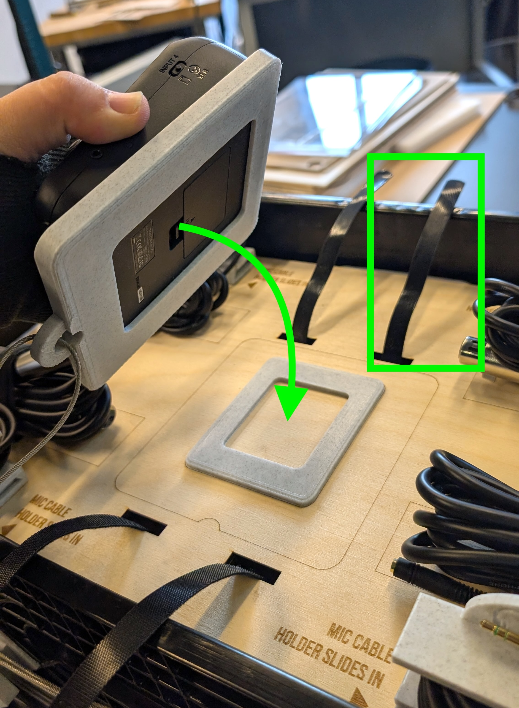
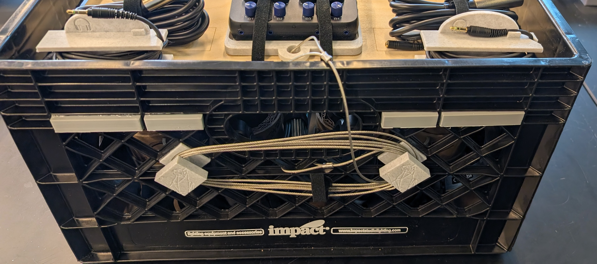

# Podcasting in the Capture Studio @ CATS

_<mark style="background-color:$warning;">**Podcasting in the Captures studio does require that you are both a**</mark>_ [_<mark style="background-color:$warning;">**CATS member**</mark>_](https://brown.edu/go/cats_orientation)_<mark style="background-color:$warning;">**, and have successfully completed the**</mark>_ [_<mark style="background-color:$warning;">**Capture Studio training**</mark>_](https://brown.edu/go/cats-capturestudio)_<mark style="background-color:$warning;">**, both of which can be done online.**</mark>_&#x20;

<mark style="background-color:orange;">Note: This resource is designed for beginers who are looking for an easy setup to start their podcasting journey. Advanced users already familiar with using audio interfaces should may use our setup for advanced workflows on their own, understanding that they must return the device back to our base settings when finished, which can be found throughout this resource. Lastly, if you are new podcasting in general, you may find our</mark> [_<mark style="background-color:orange;">**MML Podcasting Resource Guide**</mark>_](https://go.brown.edu/mmlpodcasting) <mark style="background-color:orange;">helpful</mark>

<figure><figcaption>
The Podtrak P4 Next is the latest easy to use podcasting device from Zoom. You can learn more about it below.
</figcaption></figure> <figure><figcaption>
our cutsom podcasting crate for the capture studio!
</figcaption></figure>

About the Audio Recording Device: The Podtrak P4Next

Our podcasting setup in the capture studio revolves around the Zoom Podtrack P4Next audio recorder. With our setup you can:

* have up to 4 mics, with each person having their own set of headphones (provided)
* record both in stereo (all four mics mixed down automatically into the standard 2 channel formatted file) for easy and less technical situations, as well as record each indinvidiual mic into its own separate file for more professional mixing in post-production
* AI based Noise Reduction can be used to eliminate room sound and background noise to deliver cleaner audio
* Easy on-device recording, no need to for a laptop except to transfer your files. Advanced users can also use this as an audio interface for direct recording into a DAW or to use our mics with applications like zoom, OBS, etc.&#x20;

This video gives you an overview of the Podtrak P4Next:

[https://youtu.be/OLa\_AJLdSxw](https://youtu.be/OLa_AJLdSxw)

## CATS Podcasting Crate Policies

These policies are mentioned again throughout this guide, but are organized here in no particular order for convenience:

* **It stays in the studio:** None of the podcasting equipment  or the crate should ever leave the Capture Studio, for any reason. The crate and all its contents stay in the Capture Studio&#x20;
* **Do not remove the SD Card**: There is no need to remove it. All file transfers should happen via the provided USB-C cable to your laptop or other such device. The SD card is small and when removed, often gets lost, which disrupts the service
* **Return device to base settings**: More advanced users may want to change some of the settings on the P4 Next. If you do, you are expected to return all those settings back to our base configuration at the end of your sessions. This ensures that more novice users will be able to use our setup as designed.&#x20;
* **Report Damage or Loss**: We need to know if something is non-operational so that we can address it. Email CATS@brown.edu, with a detailed description of the issue. We will not assume you caused the damage, but please be honest if you did so that we can better train you and avoid further damage in the future.&#x20;
* **Learn the Studio Policies**: These policies are in conjunction with the more general and overarching Capture Studio policies, which you should have learned about in your online training.

## The Podcasting Crate

Because the Capture Studio was originally designed for self-service easy video recording, it can't accommodate a permanent podcast recording setup, meaning it has to be setup and broken down for each session. Fortunately, we have made this as easy as possible by designing the CATS podcasting crate!

Podcasting Crate Inventory

* 4 dynamic mics
* 4 table top tripods
* 4 pairs of headphones and cables
* 4 XLR cables
* 1 Podtrak P4Next&#x20;
* 1  green extension cord
* 1 small plastic case that contains:
  * USB C cable (same for power during use and transferring to laptop after)
  * Charging Block
  * USB adapters

### Home Base.&#x20;

The podcasting crate should be stored on the bottom shelf of the rolling laptop cart in the Capture Studio when not in use. All podcasting equipment should be stored within the crate itself&#x20;

<figure><figcaption></figcaption></figure>

### Podcasting Crate Layout

<figure><figcaption></figcaption></figure> <figure><figcaption></figcaption></figure>

<figure><figcaption></figcaption></figure>

### A few things about putting things back in the Podcasting Crate.&#x20;

_<mark style="background-color:orange;">In general, its good to put things that belong in the bottom of the tray first.</mark>_

**Headphones:**

* Headphones are stored at an angle. There are some hooks under the 3D printed supports that the headphones can latch onto, but it can be a little bit of tight fit, and ultimately not necessary.&#x20;
*

    <figure><figcaption></figcaption></figure>

**Dynamic Mics:**

* The mics fit into the round carboard holders, but only if the "neck" is oriented in the correct position.&#x20;
* simply loosen the knob and rotate the neck into the position you see below
*

    <figure><figcaption></figcaption></figure>

**Headphone Cable Holders:**&#x20;

* start by wedging the begining of the cable into nook in the holder.&#x20;
* the holders themselves slide into the 3D printed holder on the tray

<figure><figcaption></figcaption></figure> <figure><figcaption></figcaption></figure>

**XLR Cables:**&#x20;

* Each XLR cable has a velcro tie down attached to it.&#x20;
* Wrap each cable first and secure with attached velcro tie down
* Use the tray velcro tie downs to hold onto the XLR Cables
*

    <figure><figcaption></figcaption></figure>

**Podtrak P4 Next:**

* The baseplate on the tray corresponds with the bottom of the P4Next enclosure.&#x20;
* Place the P4Next down onto the base plate, and then secure with the velcro tie downs
*

    <figure><figcaption></figcaption></figure>

**Security cable:**

* Once everything is put back, the last thing you should do is wrap the security cable around the security cable organizers. _<mark style="color:yellow;background-color:$danger;">**This should not be done tightly.**</mark>_ If it won't stay naturally, just use the provided velcro tie down to wrap the cable, and hang it off one of the pegs
*

    <figure><figcaption></figcaption></figure>

