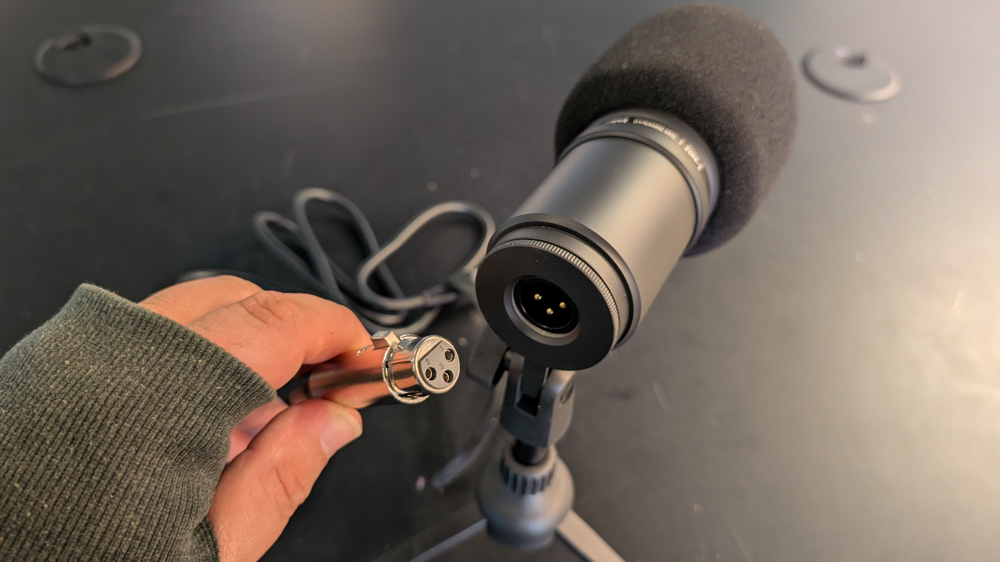
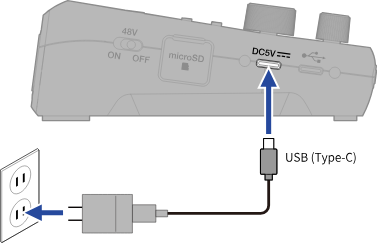

# Setting Up for Podcasting

## Setting up the Podtrak P4Next

Setup Task List

* [ ] add tripods to mics
* [ ] connect mics to P4Next
* [ ] connect headphones to P4Next
* [ ] format the SD Card
* [ ] set gain and headphone knobs to the middle
* [ ] connect P4Next to Power and turn on

### Prep your mics

1. Decide on how many mics you want to use and place them on the table in front of you
   1. _<mark style="background-color:blue;">The table provided is shared with the multi-user editing station and lives in the back of the studio</mark>_
2. Attach each mic to either one of the provided tabletop tripods or other stand, by screwing the microphone in place.&#x20;
   1.

       <figure><figcaption></figcaption></figure>

3. The mic can be raised by extending the center column of the tripod by loosening and tightening of the collet. The angle of the mic can also be adjusting loosening and tightening the knob
   1.

       <figure><figcaption></figcaption></figure>
4. Grab an XLR cable and identify the end of the plug that has the holes. line up the holes with the 3 prongs found on the underside of the microphone. Do this for each microphone you plan to use.&#x20;
   1.

       <figure><figcaption></figcaption></figure>

### Prepping Headphones

1. Remove as many headphones from the crate as you did microphones
2. detach the same number of headphone cord (3.5mm extender cable) organizers by sliding them out of their holder.
   1. <mark style="background-color:orange;">note: the headphone cords should always be stored in the cord organizers</mark>
3. Connect the headphones to the headphone cables.
4. Connect the headphone cables into the appropriate 3.5mm jack, corresponding to the labeled XLR connections, starting with 1, then 2, etc, in the front of the P4Next
   1.

       <figure><figcaption></figcaption></figure>

### Preparing the P4Next

1. Place the P4Next device in the center of the table.&#x20;
2. _<mark style="background-color:red;">**DOUBLE CHECK THAT PHANTOM POWER (48V) IS NOT ON, by finding the switch on the left side of the device**</mark>_
   1. The mics we provide are dynamic mics and do not need additional power. Giving them power may damage the mics.
3. Identify the XLR input jacks at the top of the device and then plug in the other end of the XLR cables in the jack labeled 1, then 2, etc
   1.

       
<figure><figcaption></figcaption></figure> <figure><figcaption></figcaption></figure>

4. Attach the _**USB-C cord to the DC5V**_ input on the left side of the device, as well as to the provided charging block and plug into the wall. You may need to use the provided extension cord&#x20;
   1.
5.  Make sure the "Input 4" switch is set to XLR

    <figure><figcaption></figcaption></figure>
6. Set each of your gain knobs to the middle
7.  Set each of your headphone knobs in the middle&#x20;

    <figure><figcaption></figcaption></figure>

8. <mark style="background-color:$success;">**Press the PowerButton**</mark>

### Preparing the SD Card

We will be formatting the SD card to erase any prior files so that you have the maximum storage to record.

1. To enter the menu, press the menu button, the use the up, down, and confirm buttons (also the tone, comp, and AI buttons) to navigate
2.

    <figure><figcaption></figcaption></figure>
3. navigate to <mark style="color:purple;">Menu > SD Card > Format > Execute</mark>
4. The SD Card will be formatted&#x20;

